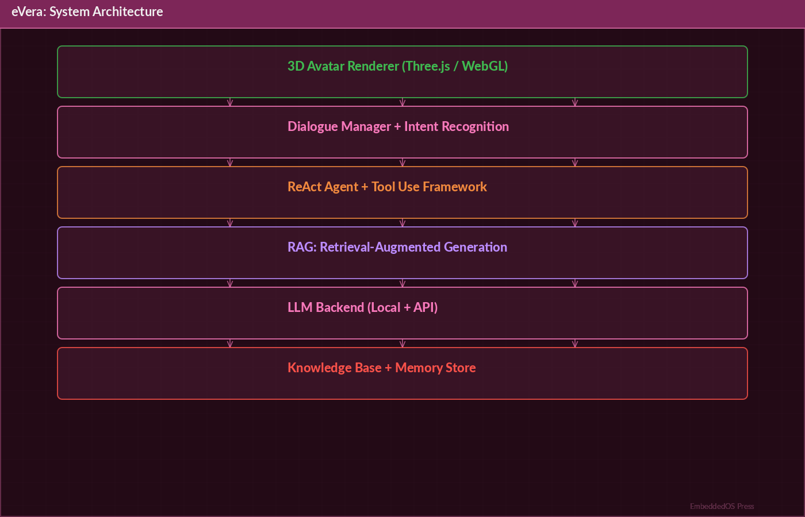
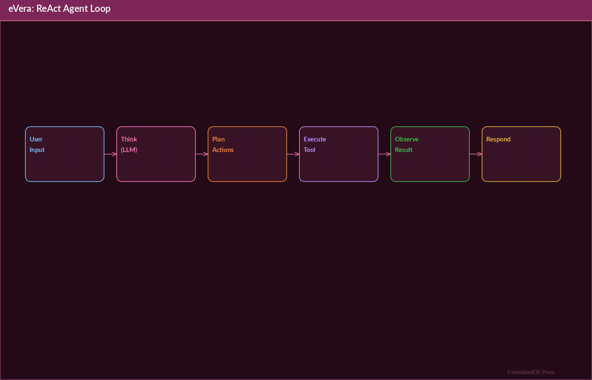
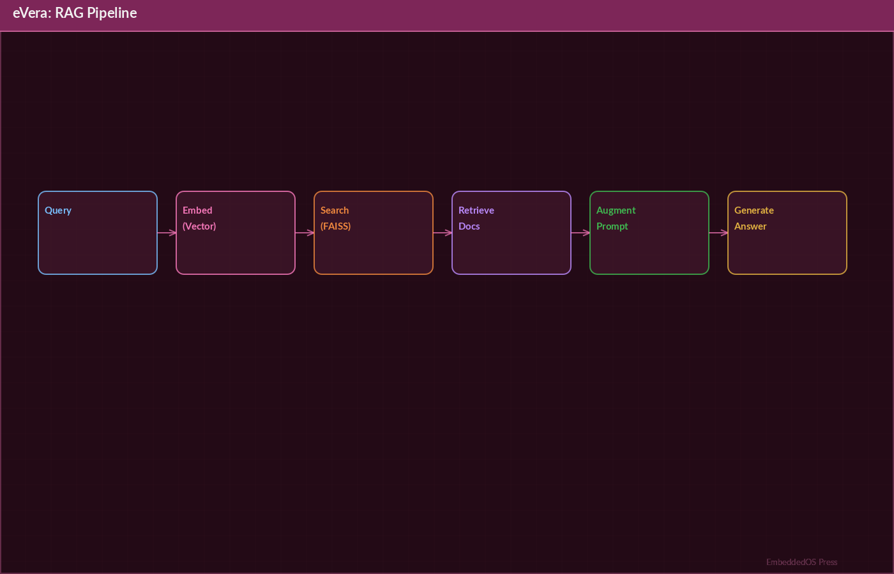

# eVera — AI Virtual Assistant Platform

## Product Reference




**Version 0.9.0**

**By Srikanth Patchava & EmbeddedOS Contributors**

**April 2026**

**EmbeddedOS Project**

---

*Licensed under the MIT License*

*Python 3.11+ · Electron 28+ · React [@yao2022] Native 0.73*

*Windows · macOS · Linux · Android · iOS*

---

## Copyright Notice

Copyright © 2026 Srikanth Patchava & EmbeddedOS Contributors.

Permission is hereby granted, free of charge, to any person obtaining a copy
of this software and associated documentation files (the "Software"), to deal
in the Software without restriction, including without limitation the rights
to use, copy, modify, merge, publish, distribute, sublicense, and/or sell
copies of the Software, and to permit persons to whom the Software is
furnished to do so, subject to the following conditions: The above copyright
notice and this permission notice shall be included in all copies or
substantial portions of the Software.

---

# Preface

eVera began as a simple question: *What if your computer could truly understand you?*

Not just respond to typed commands or parse structured queries — but listen to your
voice, understand your intent, see your screen, remember your preferences, and act
on your behalf across every application, device, and service you use daily.

This reference book documents the architecture, capabilities, and inner workings of
the eVera AI Virtual Assistant Platform at version 0.9.0. It is intended for
developers building on or extending eVera, system administrators deploying it in
production environments, and power users who want to understand the full depth of
what the platform offers.

eVera is part of the broader EmbeddedOS ecosystem — a collection of open-source
tools designed to bring intelligent, voice-first interfaces to every computing
surface. The platform ships with 24+ specialized AI agents, 183+ tools, a 3D
holographic avatar, a 4-layer memory system, and tier-based LLM routing — all
wrapped in a security-first architecture.

Whether you are integrating eVera into a smart home, using it to manage your
development workflow, or extending it with custom agents, this book is your
comprehensive guide.

We hope eVera empowers you to interact with technology in a way that feels natural,
intelligent, and truly personal.

— *Srikanth Patchava, April 2026*

---

# Table of Contents

- [Chapter 1: Introduction to eVera](#chapter-1-introduction-to-evera)
- [Chapter 2: Architecture](#chapter-2-architecture)
- [Chapter 3: Agent Framework](#chapter-3-agent-framework)
- [Chapter 4: Voice Control System](#chapter-4-voice-control-system)
- [Chapter 5: The 3D Holographic Avatar](#chapter-5-the-3d-holographic-avatar)
- [Chapter 6: LLM Provider Management](#chapter-6-llm-provider-management)
- [Chapter 7: Memory Architecture](#chapter-7-memory-architecture)
- [Chapter 8: System Control](#chapter-8-system-control)
- [Chapter 9: Smart Home Integration](#chapter-9-smart-home-integration)
- [Chapter 10: Developer Tools](#chapter-10-developer-tools)
- [Chapter 11: Desktop Application](#chapter-11-desktop-application)
- [Chapter 12: Mobile Application](#chapter-12-mobile-application)
- [Chapter 13: Security Architecture](#chapter-13-security-architecture)
- [Chapter 14: Plugin Architecture](#chapter-14-plugin-architecture)
- [Chapter 15: API Reference](#chapter-15-api-reference)
- [Appendix A: Configuration Reference](#appendix-a-configuration-reference)
- [Appendix B: Voice Command Quick Reference](#appendix-b-voice-command-quick-reference)
- [Appendix C: Troubleshooting](#appendix-c-troubleshooting)
- [Glossary](#glossary)

---

# Chapter 1: Introduction to eVera

## 1.1 Vision

eVera is a voice-first, multi-agent AI assistant that controls everything. It is
designed to be the single intelligent interface between you and your entire digital
life — your desktop, your phone, your smart home, your code repositories, your
calendar, your finances, and more.

The core vision rests on three pillars:

1. **Voice-First Interaction** — Speak naturally in 19 languages. eVera listens,
   understands, and acts. No menus, no memorized commands, no learning curve.

2. **Multi-Agent Intelligence** — Instead of a single monolithic AI, eVera deploys
   24+ specialized agents, each an expert in its domain. A Coder agent writes code.
   A Home Controller manages your lights. A Researcher finds and summarizes papers.
   They collaborate through a shared event bus and memory system.

3. **Full System Control** — eVera does not merely suggest actions; it executes them.
   It moves your mouse, types on your keyboard, manages windows, runs scripts, fills
   web forms, commits code, and controls IoT devices — all with appropriate safety
   guardrails.

## 1.2 Capabilities Overview

| Category              | Capability                                      | Agent(s)               |
|-----------------------|-------------------------------------------------|------------------------|
| Conversation          | Natural chat, jokes, mood tracking              | Companion              |
| System Control        | Apps, files, mouse, keyboard, processes          | Operator               |
| Web Automation        | Browser control, form filling, social posting    | Browser                |
| Research              | Web search, URL summarization, fact-checking     | Researcher             |
| Writing               | Drafting, editing, formatting, translation       | Writer                 |
| Productivity          | Calendar, reminders, todos, email                | Life Manager           |
| Smart Home            | Lights, thermostat, locks, security, media       | Home Controller        |
| Finance & Trading     | Prices, paper trading, Alpaca, IBKR             | Income                 |
| Development           | Code editing, search, VS Code integration        | Coder                  |
| Version Control       | Git status, diff, commit, push, PR creation      | Git                    |
| Content               | Video scripts, AI video, social scheduling       | Content Creator        |
| Personal Finance      | Bank balances, spending analysis, budgets         | Finance                |
| Planning              | Daily plans, reviews, goal setting               | Planner                |
| Wellness              | Pomodoro, breaks, screen time, energy tracking   | Wellness               |
| News                  | RSS feeds, digests, reading lists                 | Digest                 |
| Language Learning     | Lessons, vocabulary, grammar, pronunciation      | Language Tutor         |
| Code Analysis         | Indexing, architecture analysis, definitions      | Codebase Indexer       |
| Meetings              | Action items, note parsing, task creation         | Meeting                |
| Diagrams              | Call graphs, class diagrams, flowcharts           | Diagram                |
| Mobile Control        | Remote device management                         | Mobile Controller      |
| Job Search            | Resume, applications, interview prep             | Job Hunter             |
| Project Management    | Jira ticket management                           | Jira                   |
| Autonomous Dev        | Ticket to branch to code to PR to Jira           | Work Pilot             |
| Media Production      | Image gen, video assembly, subtitles, uploads     | Media Factory          |

## 1.3 Platform Support

eVera runs natively on five platforms:

- **Windows** — Electron desktop app (`.exe` installer)
- **macOS** — Electron desktop app (`.dmg` installer)
- **Linux** — Electron desktop app (`.AppImage`)
- **Android** — React Native mobile app
- **iOS** — React Native mobile app

The backend (VeraBrain) runs as a FastAPI server on `localhost:8000` and can also
be deployed to remote servers for multi-device access.

## 1.4 Quick Install

### Desktop (Electron)

Download the installer for your platform from the releases page:

- Windows: `eVera-Setup-0.9.0.exe`
- macOS: `eVera-0.9.0.dmg`
- Linux: `eVera-0.9.0.AppImage`

### From Source

```bash
# Clone the repository
git clone https://github.com/embeddedos-org/eVera.git
cd eVera

# Create a virtual environment
python3.11 -m venv .venv
source .venv/bin/activate   # Linux/macOS
# .venv\Scripts\activate    # Windows

# Install dependencies
pip install -r requirements.txt

# Start the server
python main.py --mode server
# Server starts on http://localhost:8000
```

## 1.5 First Run

On first launch, eVera will:

1. Check for required dependencies (Python 3.11+, FFmpeg, etc.)
2. Prompt you to configure at least one LLM provider (OpenAI, Gemini, or Ollama)
3. Initialize the 4-layer memory system
4. Start the proactive scheduler with 15 background loops
5. Present the glassmorphism web UI with the 3D holographic avatar

You can immediately begin speaking to eVera or typing in the chat interface.

---

# Chapter 2: Architecture

## 2.1 High-Level Overview

eVera follows a layered architecture with clear separation of concerns:

```
+-------------------------------------------------------------+
|                      CLIENT LAYER                            |
|  +--------------+  +--------------+  +---------------+      |
|  |  Electron    |  |  Web UI      |  |  React Native |      |
|  |  Desktop App |  |  (Glassmor-  |  |  Mobile App   |      |
|  |  (Win/Mac/   |  |   phism)     |  |  (Android/    |      |
|  |   Linux)     |  |              |  |   iOS)        |      |
|  +------+-------+  +------+-------+  +------+--------+      |
|         |                 |                  |               |
+---------+-----------------+------------------+---------------+
          |     REST / WebSocket / SSE         |
          +------------------+-----------------+
                             |
+----------------------------+-----------------------------+
|                      VERA BRAIN                           |
|                      (FastAPI + LangGraph)                |
|                            |                              |
|  +-------------------------+---------------------------+  |
|  |              Agent Orchestrator                      |  |
|  |  +----------+ +----------+ +----------+             |  |
|  |  |Companion | | Operator | | Browser  |  ...24+     |  |
|  |  | (4 tools)| |(26 tools)| |(11 tools)|  agents     |  |
|  |  +----------+ +----------+ +----------+             |  |
|  +------------------------------------------------------+  |
|                            |                              |
|  +------------+  +---------+------+  +----------------+   |
|  |  Memory    |  |  Provider     |  |  Safety        |   |
|  |  Vault     |  |  Manager      |  |  Policy        |   |
|  |  (4 layers)|  |  (Tier 0-3)   |  |  Engine        |   |
|  +------------+  +---------------+  +----------------+   |
|                            |                              |
|  +------------+  +---------+------+  +----------------+   |
|  |  Event     |  |  Proactive    |  |  Screen        |   |
|  |  Bus       |  |  Scheduler    |  |  Vision        |   |
|  |            |  |  (15 loops)   |  |  (GPT-4o/      |   |
|  |            |  |              |  |   Gemini)       |   |
|  +------------+  +---------------+  +----------------+   |
|                                                           |
+-----------------------------------------------------------+
```

## 2.2 VeraBrain — The Core Engine

VeraBrain is the central intelligence of eVera. It is built on two key technologies:

- **FastAPI** — High-performance async Python web framework that exposes REST
  endpoints, WebSocket connections, and Server-Sent Events (SSE) streams.

- **LangGraph** — Graph-based agent orchestration framework from LangChain [@langchain] that
  manages the flow of conversations through specialized agents, tool execution,
  and memory retrieval.

### Request Flow

```
User Input (voice/text)
        |
        v
  +-------------+
  |  FastAPI     |---- Authentication & Rate Limiting
  |  Router      |
  +------+------+
         |
         v
  +-------------+
  |  Safety      |---- PII Redaction, Command Blocking
  |  Policy      |
  +------+------+
         |
         v
  +-------------+
  |  LangGraph   |---- Agent Selection (intent classification)
  |  Orchestrator|
  +------+------+
         |
         v
  +-------------+
  |  Selected    |---- Tool Execution (1..N tools)
  |  Agent       |
  +------+------+
         |
         v
  +-------------+
  |  Memory      |---- Store interaction in episodic memory
  |  Manager     |
  +------+------+
         |
         v
  Response (text + optional actions)
```

## 2.3 Event Bus

The event bus is an internal pub/sub system that allows agents and system components
to communicate asynchronously. Key event channels include:

| Channel                | Publisher          | Subscribers              |
|------------------------|--------------------|--------------------------|
| `agent.activated`      | Orchestrator       | UI, Logger               |
| `tool.executed`        | Agent Runtime      | Memory, Logger, UI       |
| `memory.updated`       | Memory Manager     | Agents, UI               |
| `voice.transcribed`    | Voice Pipeline     | Orchestrator             |
| `screen.changed`       | Screen Vision      | Orchestrator, Agents     |
| `schedule.triggered`   | Proactive Scheduler| Orchestrator             |
| `home.device.changed`  | Home Controller    | UI, Logger               |
| `trade.signal`         | Income Agent       | UI, Safety Policy        |
| `error.occurred`       | Any Component      | Logger, UI, Alert System |

## 2.4 Proactive Scheduler

The proactive scheduler runs 15 background loops that enable eVera to take
initiative without user prompting:

1. **Calendar Check** — Polls for upcoming events every 5 minutes
2. **Email Monitor** — Checks for new emails via IMAP at configured intervals
3. **RSS Feed Refresh** — Updates subscribed feeds every 30 minutes
4. **Price Alert Monitor** — Checks financial instrument prices every minute
5. **Reminder Trigger** — Fires reminders at their scheduled times
6. **Screen Monitor** — Captures and analyzes screen content periodically
7. **System Health** — Monitors CPU, memory, disk usage
8. **Smart Home Poll** — Checks device states every 30 seconds
9. **Weather Update** — Fetches weather data every hour
10. **News Digest Builder** — Compiles news summaries twice daily
11. **Focus Session Timer** — Manages Pomodoro work/break cycles
12. **Energy Tracker** — Logs energy levels at configured intervals
13. **Burnout Prevention** — Analyzes work patterns for overwork signals
14. **Goal Progress** — Reviews goal completion weekly
15. **Memory Consolidation** — Moves working memory to long-term storag [@lewis2020]e nightly

---

# Chapter 3: Agent Framework

## 3.1 Overview

eVera intelligence is distributed across 24+ specialized agents. Each agent is
an expert in a specific domain and is equipped with a set of tools (functions) it
can invoke to accomplish tasks.

Agents are divided into two categories:

- **Core Agents** — Always loaded and available (19 agents)
- **Conditional Agents** — Loaded only when their corresponding environment
  variable is enabled (5 agents)

## 3.2 Agent Lifecycle

Every agent follows a standard lifecycle:




```
REGISTERED -> LOADED -> IDLE <-> ACTIVE -> SUSPENDED -> UNLOADED
     |                   |        |         |
     |    on startup     |  user  |  tool   |  on shutdown
     +-------------------+  query |  exec   +--------------
                                  |         |
                                  +---------+
```

1. **REGISTERED** — Agent class is discovered and registered with the orchestrator.
2. **LOADED** — Agent is instantiated, tools are bound, system prompt is set.
3. **IDLE** — Agent is ready but not currently handling a request.
4. **ACTIVE** — Agent is processing a user query and may invoke tools.
5. **SUSPENDED** — Agent is paused while awaiting an external response (API call,
   user confirmation, etc.).
6. **UNLOADED** — Agent is gracefully shut down (conditional agents only).

## 3.3 Tool Registration

Tools are Python functions decorated with `@tool` that are bound to specific agents.
Each tool declaration includes:

```python
from langchain_core.tools import tool

@tool
def open_application(app_name: str) -> str:
    """Open an application by name on the users system.

    Args:
        app_name: The name of the application to open (e.g., Chrome,
                  VS Code, Terminal).

    Returns:
        A confirmation message or error description.
    """
    # Implementation...
    return f"Opened {app_name} successfully."
```

Tools are registered to agents in the agent configuration:

```python
AGENT_CONFIG = {
    "operator": {
        "name": "Operator",
        "description": "Controls system applications, files, and processes.",
        "tools": [
            open_application,
            close_application,
            run_script,
            move_mouse,
            click_mouse,
            type_text,
            press_key,
            manage_window,
            list_processes,
            kill_process,
            # ... 26 tools total
        ],
        "system_prompt": OPERATOR_SYSTEM_PROMPT,
    },
    # ... other agents
}
```

## 3.4 Core Agents Detail

### 3.4.1 Companion Agent (4 Tools)

The Companion is the default conversational agent. It handles general chat, humor,
emotional check-ins, and activity suggestions.

| Tool               | Description                                      |
|--------------------|--------------------------------------------------|
| `chat`             | General conversation and Q&A                     |
| `tell_joke`        | Generate contextual humor                        |
| `mood_check`       | Ask about and track user mood over time           |
| `suggest_activity` | Recommend activities based on mood and time       |

### 3.4.2 Operator Agent (26 Tools)

The Operator is the most powerful core agent, providing direct control over the
operating system.

| Tool                  | Description                                   |
|-----------------------|-----------------------------------------------|
| `open_application`    | Launch applications by name                   |
| `close_application`   | Close running applications                    |
| `run_script`          | Execute shell scripts/commands                |
| `run_admin_command`   | Execute with elevated privileges              |
| `create_file`         | Create files with content                     |
| `read_file`           | Read file contents                            |
| `write_file`          | Write/overwrite file contents                 |
| `delete_file`         | Delete files                                  |
| `move_file`           | Move/rename files                             |
| `copy_file`           | Copy files                                    |
| `list_directory`      | List directory contents                       |
| `move_mouse`          | Move mouse to coordinates                     |
| `click_mouse`         | Click at position (left/right/double)         |
| `scroll_mouse`        | Scroll up/down                                |
| `type_text`           | Type text via keyboard simulation             |
| `press_key`           | Press key combinations (hotkeys)              |
| `manage_window`       | Minimize, maximize, resize, move windows      |
| `list_processes`      | List running processes                        |
| `kill_process`        | Terminate processes by name/PID               |
| `get_system_info`     | CPU, memory, disk, network info               |
| `manage_service`      | Start/stop/restart system services            |
| `get_network_info`    | IP addresses, connections, DNS                |
| `get_clipboard`       | Read clipboard contents                       |
| `set_clipboard`       | Set clipboard contents                        |
| `send_notification`   | Show system notification                      |
| `show_dialog`         | Display GUI dialog (alert, confirm, input)    |

### 3.4.3 Browser Agent (11 Tools)

The Browser agent automates web interactions using Playwright (auto-installed on
first use).

| Tool                  | Description                                   |
|-----------------------|-----------------------------------------------|
| `navigate_to`         | Open a URL in the browser                     |
| `click_element`       | Click a page element by selector              |
| `type_in_field`       | Type into an input field                      |
| `read_page`           | Extract text content from page                |
| `screenshot_page`     | Take a screenshot of the current page         |
| `fill_form`           | Auto-fill a form with provided data           |
| `login_to_site`       | Log into a website with credentials           |
| `post_social_media`   | Post content to social media platforms        |
| `download_file`       | Download a file from a URL                    |
| `execute_js`          | Execute JavaScript on the page                |
| `wait_for_element`    | Wait for an element to appear                 |

### 3.4.4 Researcher Agent (4 Tools)

| Tool                  | Description                                   |
|-----------------------|-----------------------------------------------|
| `web_search`          | Search the web via multiple search engines    |
| `summarize_url`       | Fetch and summarize a URL content             |
| `search_papers`       | Search academic papers (arXiv, Semantic Scholar) |
| `fact_check`          | Verify claims against multiple sources        |

### 3.4.5 Writer Agent (4 Tools)

| Tool                  | Description                                   |
|-----------------------|-----------------------------------------------|
| `draft_text`          | Generate drafts (emails, essays, reports)     |
| `edit_text`           | Improve existing text (grammar, style, tone)  |
| `format_text`         | Convert between formats (MD, HTML, LaTeX)     |
| `translate_text`      | Translate between 19 supported languages      |

### 3.4.6 Life Manager Agent (9 Tools)

| Tool                  | Description                                   |
|-----------------------|-----------------------------------------------|
| `create_event`        | Add calendar events                           |
| `list_events`         | View upcoming events                          |
| `set_reminder`        | Create time-based reminders                   |
| `list_reminders`      | View active reminders                         |
| `add_todo`            | Add items to todo lists                       |
| `list_todos`          | View todo items                               |
| `read_email`          | Read emails via IMAP                          |
| `reply_email`         | Reply to emails                               |
| `search_email`        | Search emails by criteria                     |

### 3.4.7 Home Controller Agent (7 Tools)

| Tool                  | Description                                   |
|-----------------------|-----------------------------------------------|
| `control_lights`      | On/off, brightness, color for smart lights    |
| `set_thermostat`      | Temperature, mode (heat/cool/auto)            |
| `control_locks`       | Lock/unlock smart locks                       |
| `arm_security`        | Arm/disarm security system                    |
| `control_media`       | Play/pause/skip on media devices              |
| `get_device_status`   | Query status of any connected device          |
| `setup_wizard`        | Guided setup for new smart home devices       |

### 3.4.8 Income Agent (15 Tools)

| Tool                  | Description                                   |
|-----------------------|-----------------------------------------------|
| `get_price`           | Real-time price for stocks, crypto, forex     |
| `get_chart`           | Price chart with technical indicators         |
| `paper_trade`         | Execute simulated trades                      |
| `paper_portfolio`     | View paper trading portfolio                  |
| `alpaca_order`        | Place order via Alpaca brokerage              |
| `alpaca_portfolio`    | View Alpaca portfolio                         |
| `alpaca_history`      | View Alpaca order history                     |
| `ibkr_order`          | Place order via Interactive Brokers           |
| `ibkr_portfolio`      | View IBKR portfolio                           |
| `ibkr_history`        | View IBKR order history                       |
| `set_price_alert`     | Set price alert for any instrument            |
| `get_market_news`     | Get latest market news                        |
| `analyze_ticker`      | Fundamental + technical analysis              |
| `backtest_strategy`   | Backtest a trading strategy                   |
| `trading_setup`       | Guided setup wizard for brokerage connections |

### 3.4.9 Coder Agent (5 Tools)

| Tool                  | Description                                   |
|-----------------------|-----------------------------------------------|
| `read_code_file`      | Read source code files                        |
| `write_code_file`     | Write/create source code files                |
| `edit_code_file`      | Edit specific sections of code                |
| `search_code`         | Search across codebase with regex             |
| `open_in_vscode`      | Open file in VS Code at specific line         |

### 3.4.10 Git Agent (10 Tools)

| Tool                  | Description                                   |
|-----------------------|-----------------------------------------------|
| `git_status`          | Show working tree status                      |
| `git_diff`            | Show changes between commits/working tree     |
| `git_add`             | Stage files for commit                        |
| `git_commit`          | Commit staged changes with message            |
| `git_push`            | Push commits to remote                        |
| `git_pull`            | Pull changes from remote                      |
| `git_branch`          | Create, list, or switch branches              |
| `git_log`             | Show commit history                           |
| `ai_code_review`      | AI-powered code review of changes             |
| `create_pr`           | Create pull request on GitHub/GitLab          |

### 3.4.11 Content Creator Agent (5 Tools)

Video script generation, AI video creation using generative models, social media
scheduling with optimal timing, SEO optimization, and multi-platform content
adaptation.

| Tool                  | Description                                   |
|-----------------------|-----------------------------------------------|
| `generate_script`     | Create video/podcast scripts from topics      |
| `create_ai_video`     | Generate video using AI models                |
| `schedule_post`       | Schedule social media posts with timing       |
| `optimize_seo`        | Analyze and optimize content for SEO          |
| `adapt_content`       | Adapt content for different platforms         |

### 3.4.12 Finance Agent (6 Tools)

| Tool                  | Description                                   |
|-----------------------|-----------------------------------------------|
| `get_balances`        | Aggregate bank balances via Plaid             |
| `list_transactions`   | List recent transactions                      |
| `analyze_spending`    | Categorize and analyze spending patterns      |
| `create_budget`       | Create monthly budgets by category            |
| `financial_report`    | Generate financial summary reports            |
| `bill_reminder`       | Set reminders for upcoming bills              |

### 3.4.13 Planner Agent (8 Tools)

| Tool                  | Description                                   |
|-----------------------|-----------------------------------------------|
| `morning_plan`        | Generate structured morning plan              |
| `daily_review`        | End-of-day review and reflection              |
| `weekly_review`       | Weekly progress summary                       |
| `monthly_review`      | Monthly retrospective and planning            |
| `set_goals`           | Define goals with SMART criteria              |
| `eisenhower_matrix`   | Prioritize tasks using Eisenhower matrix      |
| `time_block`          | Create time-blocked schedule                  |
| `track_habits`        | Log and track daily habits                    |

### 3.4.14 Wellness Agent (7 Tools)

| Tool                  | Description                                   |
|-----------------------|-----------------------------------------------|
| `focus_session`       | Start Pomodoro focus session                  |
| `take_break`          | Trigger break with stretch suggestions        |
| `screen_time`         | Track and report screen time                  |
| `log_energy`          | Log current energy level                      |
| `burnout_check`       | Analyze work patterns for burnout risk        |
| `sleep_schedule`      | Track and optimize sleep schedule             |
| `hydration_reminder`  | Set water intake reminders                    |

### 3.4.15 Digest Agent (6 Tools)

| Tool                  | Description                                   |
|-----------------------|-----------------------------------------------|
| `manage_feeds`        | Add, remove, list RSS feed subscriptions      |
| `daily_digest`        | Generate daily news digest                    |
| `reading_list`        | Curate articles for later reading             |
| `summarize_article`   | Summarize a specific article                  |
| `summarize_thread`    | Summarize Twitter/Reddit threads              |
| `topic_filter`        | Filter content by topics of interest          |

### 3.4.16 Language Tutor Agent (5 Tools)

Supports 16+ languages including Spanish, French, German, Japanese, Mandarin,
Korean, Arabic, Hindi, Portuguese, Italian, Russian, Dutch, Swedish, Turkish,
Polish, and Vietnamese.

| Tool                  | Description                                   |
|-----------------------|-----------------------------------------------|
| `start_lesson`        | Interactive language lesson                   |
| `vocabulary_drill`    | Spaced repetition vocabulary practice         |
| `grammar_exercise`    | Grammar explanations and exercises            |
| `pronunciation`       | Pronunciation practice with speech feedback   |
| `language_quiz`       | Adaptive difficulty quizzes                   |

### 3.4.17 Codebase Indexer Agent (4 Tools)

| Tool                  | Description                                   |
|-----------------------|-----------------------------------------------|
| `index_project`       | Full project indexing via AST parsing         |
| `analyze_architecture`| Architecture pattern identification           |
| `extract_definitions` | Map symbols to definition locations           |
| `find_related_files`  | Discover related files by import chains       |

### 3.4.18 Meeting Agent (3 Tools)

| Tool                  | Description                                   |
|-----------------------|-----------------------------------------------|
| `extract_actions`     | Extract action items from transcripts         |
| `parse_notes`         | Parse structured meeting notes                |
| `create_tasks`        | Create tasks from meeting discussions         |

### 3.4.19 Diagram Agent (4 Tools)

| Tool                  | Description                                   |
|-----------------------|-----------------------------------------------|
| `call_graph`          | Generate call graphs from source code         |
| `class_diagram`       | Create class diagrams from OOP code           |
| `flowchart`           | Produce flowcharts from procedural logic      |
| `export_diagram`      | Export diagrams to SVG, PNG, or PDF           |

## 3.5 Conditional Agents

Conditional agents are loaded only when their corresponding environment variable
is set to true.

### 3.5.1 Mobile Controller (6 Tools)

**Enabled by:** VERA_MOBILE_CONTROL_ENABLED=true

Controls a connected mobile device via ADB (Android) or a custom bridge (iOS).

| Tool                  | Description                                   |
|-----------------------|-----------------------------------------------|
| launch_app            | Open an app on the mobile device              |
| read_notifications    | Read recent notifications                     |
| manage_calls          | Answer, reject, or place calls                |
| send_sms              | Send text messages                            |
| mobile_screenshot     | Capture the mobile screen                     |
| simulate_gesture      | Perform taps, swipes, pinches                 |

### 3.5.2 Job Hunter (12 Tools)

**Enabled by:** VERA_JOB_ENABLED=true

Comprehensive job search automation including resume parsing, job board searching
(LinkedIn, Indeed, Glassdoor), application tracking, cover letter generation,
interview scheduling, mock interview preparation, salary negotiation research,
company analysis, networking suggestions, follow-up drafting, offer comparison,
and career roadmap planning.

### 3.5.3 Jira Agent (7 Tools)

**Enabled by:** VERA_JIRA_ENABLED=true

Full Jira integration: create issues, update issues, search with JQL, list sprints,
add comments, transition issue status, and generate sprint reports.

### 3.5.4 Work Pilot (3 Tools)

**Enabled by:** VERA_JIRA_ENABLED=true

Autonomous development workflow: takes a Jira ticket, creates a git branch, writes
code based on the ticket description, creates a pull request, and updates the Jira
ticket with the PR link.

| Tool                  | Description                                   |
|-----------------------|-----------------------------------------------|
| autonomous_develop    | Full ticket to branch to code to PR to Jira   |
| review_pilot_output   | Review and iterate on generated code          |
| pilot_status          | Check status of ongoing autonomous work       |

### 3.5.5 Media Factory (12 Tools)

**Enabled by:** VERA_MEDIA_ENABLED=true

Professional media production: AI image generation (DALL-E, Stable Diffusion),
photo editing, video assembly, subtitle generation, AI voiceover, music overlay,
thumbnail creation, YouTube upload, Instagram upload, TikTok upload, batch
processing, and media asset management.

## 3.6 Agent Communication

Agents communicate through the event bus using a message-passing pattern:

```python
await event_bus.emit("agent.request", {
    "from": "planner",
    "to": "life_manager",
    "action": "create_event",
    "params": {
        "title": "Weekly Review",
        "time": "2026-04-25T17:00:00",
        "duration": 30
    }
})
```

---

# Chapter 4: Voice Control System

## 4.1 Overview

eVera is built voice-first. The voice control system supports three distinct
modes of activation, 19 languages, real-time speech recognition, text-to-speech
output, and auto spell-correction.

## 4.2 Three Voice Modes

### 4.2.1 Always-On Listening

In this mode, eVera continuously listens for speech and processes everything it
hears. This provides the most natural interaction but requires more system resources
and may pick up unintended speech.

Configuration:

```
VERA_VOICE_MODE=always_on
VERA_VOICE_SENSITIVITY=0.7
VERA_VOICE_SILENCE_TIMEOUT=2
```

### 4.2.2 Wake Word Detection

eVera listens for a configurable wake word (default: "Hey Vera") before activating.
This balances convenience with resource usage and privacy.

Configuration:

```
VERA_VOICE_MODE=wake_word
VERA_WAKE_WORD=hey vera
VERA_WAKE_WORD_SENSITIVITY=0.5
```

The wake word engine uses a lightweight on-device model that runs without sending
audio to any cloud service. Once the wake word is detected, subsequent speech is
processed through the configured speech recognition provider.

### 4.2.3 Push-to-Talk

The user presses and holds a configurable hotkey (default: Ctrl+Shift+Space) to
activate the microphone. Maximum privacy and zero false activations.

Configuration:

```
VERA_VOICE_MODE=push_to_talk
VERA_PTT_HOTKEY=ctrl+shift+space
```

## 4.3 Speech Recognition Pipeline

```
Microphone Input
      |
      v
+---------------+
|  Audio        |---- Noise reduction, VAD (Voice Activity Detection)
|  Preprocessing|
+------+--------+
       |
       v
+---------------+
|  Speech-to-   |---- Whisper (local) or Cloud STT
|  Text (STT)   |
+------+--------+
       |
       v
+---------------+
|  Auto Spell   |---- Language-specific correction
|  Correction   |
+------+--------+
       |
       v
+---------------+
|  Intent       |---- Route to appropriate agent
|  Processing   |
+---------------+
```

## 4.4 Supported Languages

eVera supports 19 languages for both speech recognition and text-to-speech:

| Language    | Code  | STT | TTS | Spell Correction |
|-------------|-------|-----|-----|------------------|
| English     | en    | Yes | Yes | Yes              |
| Spanish     | es    | Yes | Yes | Yes              |
| French      | fr    | Yes | Yes | Yes              |
| German      | de    | Yes | Yes | Yes              |
| Italian     | it    | Yes | Yes | Yes              |
| Portuguese  | pt    | Yes | Yes | Yes              |
| Russian     | ru    | Yes | Yes | Yes              |
| Chinese     | zh    | Yes | Yes | Yes              |
| Japanese    | ja    | Yes | Yes | Yes              |
| Korean      | ko    | Yes | Yes | Yes              |
| Arabic      | ar    | Yes | Yes | Yes              |
| Hindi       | hi    | Yes | Yes | Yes              |
| Dutch       | nl    | Yes | Yes | Yes              |
| Polish      | pl    | Yes | Yes | Yes              |
| Swedish     | sv    | Yes | Yes | Yes              |
| Turkish     | tr    | Yes | Yes | Yes              |
| Vietnamese  | vi    | Yes | Yes | Yes              |
| Thai        | th    | Yes | Yes | Yes              |
| Indonesian  | id    | Yes | Yes | Yes              |

## 4.5 Text-to-Speech (TTS)

eVera responds with natural-sounding speech. The TTS system supports multiple
voices and providers:

- **Local**: Piper TTS (offline, fast, multiple voices)
- **Cloud**: OpenAI TTS, Google Cloud TTS, Azure Speech Services

Configuration:

```
VERA_TTS_PROVIDER=piper
VERA_TTS_VOICE=vera_default
VERA_TTS_SPEED=1.0
VERA_TTS_PITCH=1.0
```

## 4.6 Auto Spell-Correction

The auto spell-correction system processes STT output to fix common transcription
errors. It uses language-specific dictionaries and contextual analysis:

- Corrects homophones based on context
- Fixes technical terms often misheard by generic STT models
- Learns custom vocabulary from user interactions over time
- Handles code-related terminology (function names, variable names)

---

# Chapter 5: The 3D Holographic Avatar

## 5.1 Overview

Version 0.9.0 introduces a production-hardened 3D holographic avatar rendered in
the web UI using Three.js [@threejs] and WebGL. The avatar provides visual feedback during
conversations, displaying gestures, expressions, and ambient effects.

## 5.2 Technical Stack

| Component          | Technology                                      |
|--------------------|-------------------------------------------------|
| 3D Engine          | Three.js (WebGL renderer)                       |
| Model Format       | GLTF/GLB humanoid mesh                          |
| Shader System      | Custom ShaderMaterial (GLSL)                     |
| Animation          | Three.js AnimationMixer                          |
| Particle System    | Three.js Points with BufferGeometry              |
| Performance        | FPS monitoring, Page Visibility API              |
| Security           | CSP headers for WebGL contexts                   |
| Fallback           | 2D avatar SVG when WebGL is unavailable          |

## 5.3 Holographic ShaderMaterial

The avatar distinctive holographic look is achieved through a custom GLSL shader
with three visual layers:

### 5.3.1 Fresnel Rim Glow

Creates a glowing edge effect that brightens surfaces viewed at grazing angles:

```glsl
// Vertex shader
varying vec3 vNormal;
varying vec3 vViewPosition;

void main() {
    vNormal = normalize(normalMatrix * normal);
    vec4 mvPosition = modelViewMatrix * vec4(position, 1.0);
    vViewPosition = -mvPosition.xyz;
    gl_Position = projectionMatrix * mvPosition;
}

// Fragment shader (excerpt)
float fresnel = pow(1.0 - dot(normalize(vViewPosition), vNormal), 3.0);
vec3 rimColor = vec3(0.0, 0.8, 1.0) * fresnel * rimIntensity;
```

### 5.3.2 Circuit-Line UV Grid

A procedural grid pattern overlaid on the mesh surface that evokes circuit board
traces:

```glsl
// Fragment shader (excerpt)
float gridX = smoothstep(0.48, 0.5, fract(vUv.x * gridDensity));
float gridY = smoothstep(0.48, 0.5, fract(vUv.y * gridDensity));
float grid = max(gridX, gridY) * gridOpacity;
vec3 gridColor = vec3(0.0, 0.5, 1.0) * grid;
```

### 5.3.3 Energy Pulse

A periodic wave of energy that sweeps vertically through the avatar:

```glsl
// Fragment shader (excerpt)
float pulse = sin(vWorldPosition.y * 4.0 + time * 2.0) * 0.5 + 0.5;
pulse = smoothstep(0.3, 0.7, pulse) * pulseIntensity;
vec3 pulseColor = vec3(0.0, 1.0, 0.8) * pulse;
```

## 5.4 Gesture Animations

The avatar supports 8 gesture animations mapped to conversational states:

| Gesture          | Trigger                          | Duration |
|------------------|----------------------------------|----------|
| idle_breathe     | Default state                    | Loop     |
| listening        | Microphone active                | Loop     |
| thinking         | Processing user query            | Loop     |
| speaking         | TTS output active                | Loop     |
| nodding          | Acknowledgment                   | 1.5s     |
| waving           | Greeting                         | 2.0s     |
| pointing         | Directing attention              | 1.8s     |
| celebrating      | Task completion                  | 2.5s     |

## 5.5 Particle Aura System

A 200-particle aura surrounds the avatar, creating an ambient holographic effect:

```javascript
const particleCount = 200;
const geometry = new THREE.BufferGeometry();
const positions = new Float32Array(particleCount * 3);

for (let i = 0; i < particleCount; i++) {
    const theta = Math.random() * Math.PI * 2;
    const phi = Math.acos(2 * Math.random() - 1);
    const r = 1.5 + Math.random() * 0.5;

    positions[i * 3]     = r * Math.sin(phi) * Math.cos(theta);
    positions[i * 3 + 1] = r * Math.sin(phi) * Math.sin(theta);
    positions[i * 3 + 2] = r * Math.cos(phi);
}

geometry.setAttribute("position",
    new THREE.BufferAttribute(positions, 3));

const material = new THREE.PointsMaterial({
    color: 0x00ccff,
    size: 0.03,
    transparent: true,
    opacity: 0.6,
    blending: THREE.AdditiveBlending,
});

const particles = new THREE.Points(geometry, material);
scene.add(particles);
```

## 5.6 Performance Hardening

The avatar system includes several production safeguards:

- **WebGL Fallback** — If WebGL is unavailable or fails to initialize, the UI
  falls back to a 2D SVG avatar with CSS animations.
- **Page Visibility API** — Animation loops are paused when the browser tab is not
  visible, saving GPU resources.
- **FPS Monitoring** — If the frame rate drops below 20 FPS for more than 5 seconds,
  particle count and shader complexity are automatically reduced.
- **CSP Headers** — Content Security Policy headers are configured to allow WebGL
  shader compilation while blocking unauthorized script execution.

---

# Chapter 6: LLM Provider Management

## 6.1 Tier-Based Routing

eVera uses a 4-tier routing system to balance cost, speed, and capability:

```
+-----------------------------------------------------------+
|                      USER QUERY                            |
+--------------------------+--------------------------------+
                           |
                           v
                  +----------------+
                  |  Intent        |
                  |  Classifier    |
                  +-------+--------+
                          |
          +---------------+---------------+--------------+
          |               |               |              |
          v               v               v              v
   +------------+  +----------+  +-----------+  +----------+
   |  Tier 0    |  |  Tier 1  |  |  Tier 2   |  |  Tier 3  |
   |  Reflex    |  | Executor |  | Specialist|  | Strategist|
   |            |  |          |  |           |  |          |
   |  Regex     |  |  Ollama  |  | GPT-4o-   |  |  GPT-4o  |
   |  patterns  |  |  local   |  | mini /    |  |          |
   |            |  |          |  | Gemini    |  |          |
   |  FREE      |  |  FREE    |  | Flash $   |  |   $$     |
   +------------+  +----------+  +-----------+  +----------+
```

### 6.1.1 Tier 0: Reflex (Free)

Simple regex pattern matching for commands that do not need AI:

- "What time is it?" maps to System clock
- "Open Chrome" maps to Direct OS command
- "Set volume to 50%" maps to Direct system call
- "Remind me in 10 minutes" maps to Timer creation

### 6.1.2 Tier 1: Executor (Free)

Local LLM via Ollama for moderate complexity tasks that benefit from AI reasoning
but do not require frontier model capabilities:

- File management operations
- Simple code generation
- Basic Q&A from memory
- System control sequences

Supported models: Llama 3, Mistral, CodeLlama, Phi-3, Gemma

### 6.1.3 Tier 2: Specialist ($)

Cloud LLMs for tasks requiring strong language understanding and generation:

- Email composition
- Document summarization
- Code review
- Research synthesis
- Translation

Providers: GPT-4o-mini (OpenAI), Gemini 1.5 Flash (Google)

### 6.1.4 Tier 3: Strategist ($$)

Frontier models for the most complex tasks:

- Multi-step reasoning
- Complex code generation
- Creative writing
- Strategic planning
- Vision analysis (screen understanding)

Providers: GPT-4o (OpenAI), Gemini 1.5 Pro (Google)

## 6.2 Provider Configuration

```bash
# OpenAI
VERA_OPENAI_API_KEY=sk-...
VERA_OPENAI_MODEL_TIER2=gpt-4o-mini
VERA_OPENAI_MODEL_TIER3=gpt-4o

# Google Gemini
VERA_GEMINI_API_KEY=AI...
VERA_GEMINI_MODEL_TIER2=gemini-1.5-flash
VERA_GEMINI_MODEL_TIER3=gemini-1.5-pro

# Ollama (local)
VERA_OLLAMA_BASE_URL=http://localhost:11434
VERA_OLLAMA_MODEL=llama3:8b
```

## 6.3 Fallback Chain

If a provider fails, eVera automatically falls back to the next available provider:

```
Primary Provider -> Secondary Provider -> Ollama Local -> Tier 0 Regex
```

This ensures eVera remains functional even without internet connectivity.

## 6.4 Cost Tracking

eVera tracks API usage and costs per provider:

```json
{
    "period": "2026-04",
    "providers": {
        "openai": {"requests": 1243, "tokens": 892341, "cost_usd": 4.12},
        "gemini": {"requests": 567, "tokens": 423100, "cost_usd": 1.85}
    },
    "total_cost_usd": 5.97,
    "tier_breakdown": {
        "tier0": 3421,
        "tier1": 892,
        "tier2": 1567,
        "tier3": 243
    }
}
```

---

# Chapter 7: Memory Architecture

## 7.1 The 4-Layer Memory System

eVera implements a biologically-inspired 4-layer memory system:

```
+-----------------------------------------+
|           WORKING MEMORY                 |
|  Current conversation context            |
|  Last 10 messages, active agent state    |
|  Fast, volatile, per-session             |
+-----------------------------------------+
|           EPISODIC MEMORY                |
|  Past interactions stored as vectors     |
|  FAISS index for similarity search       |
|  Persistent, searchable                  |
+-----------------------------------------+
|           SEMANTIC MEMORY                |
|  Extracted user facts and preferences    |
|  "User likes Python", "User is vegan"   |
|  Persistent, structured                  |
+-----------------------------------------+
|           ENCRYPTED VAULT                |
|  Sensitive data (credentials, keys)      |
|  AES-256-GCM encryption at rest          |
|  Persistent, encrypted                   |
+-----------------------------------------+
```

## 7.2 Working Memory

Working memory holds the current conversation context. It is volatile and resets
at the start of each session (though the last session context can be restored).

- **Capacity:** Last 10 messages (configurable via VERA_WORKING_MEMORY_SIZE)
- **Contents:** User messages, assistant responses, tool call results, active agent
- **Lifecycle:** Created on session start, cleared on session end

## 7.3 Episodic Memory (FAISS Vectors)

Episodic memory stores past interactions as vector embeddings in a FAISS index.
This allows eVera to recall relevant past conversations through semantic similarity
search.

```python
# Storing a new episodic memory
embedding = embed_model.encode(interaction_text)
faiss_index.add(np.array([embedding]))
metadata_store.append({
    "text": interaction_text,
    "timestamp": datetime.utcnow().isoformat(),
    "agent": active_agent,
    "sentiment": sentiment_score,
})

# Retrieving relevant memories
query_embedding = embed_model.encode(current_query)
distances, indices = faiss_index.search(
    np.array([query_embedding]), k=5
)
relevant_memories = [metadata_store[i] for i in indices[0]]
```

## 7.4 Semantic Memory

Semantic memory stores extracted facts about the user as structured key-value pairs.
These are automatically extracted from conversations and can also be manually managed.

Example response from GET /api/v1/memory/facts:

```json
{
    "facts": [
        {"key": "name", "value": "Srikanth", "confidence": 0.99},
        {"key": "language", "value": "Python", "confidence": 0.95},
        {"key": "location", "value": "Sunnyvale", "confidence": 0.90},
        {"key": "diet", "value": "vegetarian", "confidence": 0.85},
        {"key": "wake_time", "value": "06:30", "confidence": 0.80},
        {"key": "preferred_ide", "value": "VS Code", "confidence": 0.92}
    ]
}
```

## 7.5 Encrypted Vault

The encrypted vault stores sensitive information using AES-256-GCM encryption:

- API keys and tokens
- Brokerage credentials
- Email passwords
- Smart home device credentials
- SSH keys

The vault key is derived from a user-provided master password using PBKDF2 with
600,000 iterations.

```python
from cryptography.hazmat.primitives.ciphers.aead import AESGCM

key = derive_key(master_password, salt, iterations=600_000)
aesgcm = AESGCM(key)
nonce = os.urandom(12)
ciphertext = aesgcm.encrypt(nonce, plaintext.encode(), None)
```

## 7.6 Memory Consolidation

The nightly memory consolidation process (run by the proactive scheduler):

1. Reviews working memory from the day sessions
2. Extracts important interactions and stores them in episodic memory
3. Identifies new user facts and updates semantic memory
4. Prunes low-relevance episodic memories older than 90 days
5. Rebuilds the FAISS index for optimal search performance

---

# Chapter 8: System Control

## 8.1 Operator Agent Overview

The Operator agent provides full control over the user operating system. With
26 tools, it can manage applications, files, input devices, windows, processes,
services, and system information.

## 8.2 Mouse Control

```python
# Move mouse to absolute coordinates
await operator.move_mouse(x=500, y=300)

# Click at current position
await operator.click_mouse(button="left")

# Double-click at specific position
await operator.click_mouse(x=500, y=300, button="left", clicks=2)

# Right-click
await operator.click_mouse(button="right")

# Scroll
await operator.scroll_mouse(direction="down", amount=3)
```

## 8.3 Keyboard Control

```python
# Type text
await operator.type_text("Hello, world!")

# Press key combinations
await operator.press_key("ctrl+c")       # Copy
await operator.press_key("ctrl+v")       # Paste
await operator.press_key("alt+tab")      # Switch window
await operator.press_key("ctrl+shift+t") # Reopen tab
```

## 8.4 Window Management

```python
# List all windows
windows = await operator.list_windows()

# Manage specific window
await operator.manage_window(
    title="Visual Studio Code",
    action="maximize"  # minimize | maximize | restore | close | focus
)

# Move and resize
await operator.manage_window(
    title="Terminal",
    action="move",
    x=100, y=100, width=800, height=600
)
```

## 8.5 Process Management

```python
# List processes with CPU/memory usage
processes = await operator.list_processes(sort_by="cpu")

# Kill process
await operator.kill_process(name="chrome")
await operator.kill_process(pid=12345)
```

## 8.6 Screen Vision

Screen Vision uses GPT-4o or Gemini vision capabilities to understand what is on
the user screen:

```python
# One-time screen analysis
result = await screen_vision.analyze(
    prompt="What application is currently in focus?"
)

# Continuous monitoring with hash-based debounce
# Only triggers analysis when screen content actually changes
await screen_vision.start_monitoring(
    interval=5,  # seconds
    debounce=True,
    callback=handle_screen_change
)
```

The hash-based debounce system captures screen frames, computes a perceptual hash,
and only sends frames to the vision model when the hash differs significantly from
the previous frame. This prevents redundant API calls when the screen is static.

## 8.7 File Operations

The Operator agent provides comprehensive file management:

```python
# Create a file
await operator.create_file("/home/user/notes.txt", content="My notes")

# Read file contents
content = await operator.read_file("/home/user/notes.txt")

# Copy and move files
await operator.copy_file("/home/user/notes.txt", "/backup/notes.txt")
await operator.move_file("/tmp/download.zip", "/home/user/files/")

# List directory contents
files = await operator.list_directory("/home/user/projects")
```

## 8.8 System Information

```python
# Get comprehensive system info
info = await operator.get_system_info()
# Returns: CPU model, cores, usage, RAM total/used, disk space,
#          OS version, hostname, uptime, network interfaces

# Network information
network = await operator.get_network_info()
# Returns: IP addresses, active connections, DNS servers, gateway
```

---

# Chapter 9: Smart Home Integration

## 9.1 Overview

The Home Controller agent enables voice-controlled smart home management. It
supports common IoT protocols and can discover, configure, and control devices
throughout the home.

## 9.2 Supported Protocols

| Protocol       | Description                             | Devices                |
|----------------|-----------------------------------------|------------------------|
| MQTT           | Lightweight messaging protocol           | Generic IoT sensors    |
| HTTP/REST      | Direct API calls to smart devices        | Hue, LIFX, Wemo       |
| WebSocket      | Real-time bidirectional communication    | Custom devices         |
| Home Assistant | Integration via HA REST API              | 2000+ device types     |

## 9.3 Device Categories

### 9.3.1 Lighting

```
Voice: "Hey Vera, set the living room lights to 50% warm white"

Action: control_lights(
    device="living_room_lights",
    brightness=50,
    color_temp=3000  # Kelvin
)
```

### 9.3.2 Climate

```
Voice: "Set the thermostat to 72 degrees in cooling mode"

Action: set_thermostat(
    temperature=72,
    mode="cool",
    unit="fahrenheit"
)
```

### 9.3.3 Security

```
Voice: "Lock all doors and arm the security system"

Actions:
  control_locks(device="all", action="lock")
  arm_security(mode="away")
```

### 9.3.4 Media

```
Voice: "Play my jazz playlist on the living room speaker"

Action: control_media(
    device="living_room_speaker",
    action="play",
    content="jazz playlist"
)
```

## 9.4 Setup Wizard

The setup wizard (setup_wizard tool) provides a guided experience for connecting
new smart home devices:

1. **Discovery** — Scan the local network for compatible devices
2. **Authentication** — Provide device credentials or API keys
3. **Naming** — Assign friendly names to devices ("Living Room Lamp")
4. **Room Assignment** — Group devices by room for natural voice control
5. **Testing** — Verify connectivity and basic control
6. **Automation** — Set up basic routines (e.g., "Goodnight" turns off all lights)

## 9.5 Automation Routines

eVera supports custom automation routines that chain multiple device actions:

| Routine        | Actions                                              |
|----------------|------------------------------------------------------|
| Good Morning   | Lights on 50%, thermostat to 72F, play news digest   |
| Leaving Home   | Lights off, thermostat eco mode, lock doors, arm     |
| Coming Home    | Lights on, thermostat comfort, unlock front door     |
| Movie Time     | Dim lights to 10%, TV on, close blinds               |
| Goodnight      | All lights off, thermostat night mode, lock all, arm |

Routines can be triggered by voice command, schedule, or geofence.

---

# Chapter 10: Developer Tools

## 10.1 Overview

eVera provides a comprehensive suite of developer tools through five agents:
Coder, Git, Jira, Work Pilot, and Codebase Indexer. Together, they cover the
entire software development lifecycle from code writing to deployment.

## 10.2 Coder Agent

The Coder agent provides intelligent code editing with context awareness:

```
Voice: "Open the main.py file and add error handling to the login function"

Actions:
  1. read_code_file("main.py")
  2. Analyze the login function
  3. Generate error handling code
  4. edit_code_file("main.py", changes=[...])
  5. open_in_vscode("main.py", line=42)
```

## 10.3 Git Agent

The Git agent manages version control operations with AI-enhanced features:

```
Voice: "Review my changes, commit them with a good message, and push"

Actions:
  1. git_status()     -> list modified files
  2. git_diff()       -> show changes
  3. ai_code_review() -> analyze code quality
  4. git_add(".")
  5. git_commit(message="feat: add OAuth2 login with token refresh")
  6. git_push()
```

The AI code review tool analyzes:
- Code quality and style consistency
- Potential bugs and edge cases
- Security vulnerabilities
- Performance concerns
- Test coverage gaps

## 10.4 Jira Integration

When VERA_JIRA_ENABLED=true, the Jira agent provides full ticket management:

```bash
VERA_JIRA_URL=https://yourcompany.atlassian.net
VERA_JIRA_EMAIL=you@company.com
VERA_JIRA_API_TOKEN=your_token
VERA_JIRA_PROJECT_KEY=PROJ
```

Example interactions:

```
Voice: "Create a Jira ticket for the login bug"
-> create_issue(summary="Login fails on mobile", type="Bug", priority="High")

Voice: "What are my open tickets?"
-> search_jql("assignee = currentUser() AND status != Done")

Voice: "Move PROJ-456 to In Progress"
-> transition_issue("PROJ-456", status="In Progress")
```

## 10.5 Work Pilot — Autonomous Development

Work Pilot is eVera most ambitious developer tool. Given a Jira ticket, it
autonomously:

1. Reads and understands the ticket requirements
2. Creates a feature branch from the ticket key
3. Generates code that satisfies the requirements
4. Writes unit tests for the generated code
5. Runs tests and iterates until they pass
6. Creates a pull request with a detailed description
7. Updates the Jira ticket with the PR link and transitions its status

```
Voice: "Work Pilot, take PROJ-1234 and implement it"

Work Pilot Flow:
  Read Ticket -> Create Branch -> Generate Code ->
  Run Tests -> Create PR -> Update Jira
```

## 10.6 Codebase Indexer

The Codebase Indexer creates a searchable index of entire projects:

- **AST Parsing** — Extracts function definitions, class hierarchies, imports
- **Architecture Analysis** — Identifies patterns (MVC, microservices, etc.)
- **Definition Extraction** — Maps every symbol to its definition location
- **Related Files** — Given a file, finds all related files by import chains

```
Voice: "Index the eVera project and show me the architecture"

Result:
  Project: eVera
  Language: Python (87%), TypeScript (10%), GLSL (3%)
  Architecture: Modular agent-based with event bus
  Modules: 24 agents, 183 tools, 15 background services
  Entry Point: main.py -> FastAPI app
  Key Patterns: Repository pattern, Observer pattern, Strategy pattern
```

---

# Chapter 11: Desktop Application

## 11.1 Electron Shell

The eVera desktop application is built with Electron 28+, providing a native
desktop experience on Windows, macOS, and Linux.

### 11.1.1 Architecture

```
+---------------------------------------------+
|              Electron Shell                  |
|  +-----------------------------------------+ |
|  |           Main Process                   | |
|  |  - Backend lifecycle management          | |
|  |  - System tray integration               | |
|  |  - Auto-updater                          | |
|  |  - Global hotkey registration            | |
|  |  - Native menu                           | |
|  +---------------------+-------------------+ |
|                         | IPC                 |
|  +-----------------------------------------+ |
|  |          Renderer Process                | |
|  |  - Glassmorphism Web UI                  | |
|  |  - 3D Holographic Avatar                 | |
|  |  - Chat interface                        | |
|  |  - Settings panel                        | |
|  |  - Agent status dashboard                | |
|  +-----------------------------------------+ |
+---------------------------------------------+
                     |
                     | HTTP/WebSocket
                     v
          +--------------------+
          |    VeraBrain        |
          |    (FastAPI)        |
          |    localhost:8000   |
          +--------------------+
```

## 11.2 Auto-Start Backend

When the Electron app launches, it automatically:

1. Checks if the Python virtual environment exists
2. Starts the VeraBrain FastAPI server as a child process
3. Waits for the health check endpoint (/health) to respond
4. Loads the web UI once the backend is ready
5. Shows a splash screen during initialization

If the backend fails to start, the Electron app displays a diagnostic panel with
error logs and suggested fixes.

## 11.3 System Tray

The system tray icon provides:

- **Quick Actions** — Mute/unmute microphone, toggle voice mode
- **Status Indicator** — Green (connected), yellow (processing), red (error)
- **Mini Chat** — Quick text input without opening the full window
- **Settings Shortcut** — Direct access to settings
- **Quit** — Graceful shutdown of both Electron and VeraBrain

## 11.4 Glassmorphism UI

The web UI features a glassmorphism design with:

- Frosted glass panels with backdrop blur
- Semi-transparent backgrounds with subtle borders
- Smooth animations and transitions
- Dark mode by default with light mode option
- Responsive layout (resizable window)

Key UI components:

| Component          | Description                                      |
|--------------------|--------------------------------------------------|
| Chat Panel         | Main conversation interface with message history |
| Avatar Viewport    | 3D holographic avatar display                    |
| Agent Sidebar      | Shows loaded agents and their status             |
| Tool Activity      | Real-time feed of tool executions                |
| Settings Modal     | Configuration for all system settings            |
| Memory Browser     | View and manage semantic memory facts            |
| Voice Indicator    | Visual feedback for voice mode status            |

## 11.5 Auto-Updates

The Electron app checks for updates on startup and periodically:

1. Check GitHub releases for new version
2. Download update in background
3. Notify user: "eVera 0.9.1 is available"
4. User confirms then install and restart
5. Automatic rollback if update fails

## 11.6 Global Hotkeys

The desktop app registers global hotkeys that work even when eVera is not focused:

| Hotkey              | Action                                       |
|---------------------|----------------------------------------------|
| Ctrl+Shift+Space    | Push-to-talk (default PTT key)               |
| Ctrl+Shift+V        | Toggle eVera window visibility               |
| Ctrl+Shift+M        | Mute/unmute microphone                       |
| Ctrl+Shift+S        | Take screenshot for Screen Vision            |

---

# Chapter 12: Mobile Application

## 12.1 React Native Architecture

The eVera mobile app is built with React Native 0.73, sharing a single codebase
for Android and iOS.

### 12.1.1 Stack

| Layer              | Technology                                   |
|--------------------|----------------------------------------------|
| UI Framework       | React Native 0.73                            |
| Navigation         | React Navigation 6                           |
| State Management   | Zustand                                      |
| Voice Input        | react-native-voice                           |
| WebSocket          | Built-in React Native WebSocket              |
| Push Notifications | Firebase Cloud Messaging (Android) / APNs    |
| Local Storage      | AsyncStorage + SQLite                        |

## 12.2 Connectivity

The mobile app connects to the VeraBrain server via:

- **Local Network** — When on the same Wi-Fi as the desktop
- **Remote Server** — When VeraBrain is deployed to a cloud server
- **Mobile WebSocket** — Dedicated /ws/mobile endpoint for mobile-optimized
  communication

```
VERA_SERVER_URL=http://192.168.1.100:8000  # Local
VERA_SERVER_URL=https://vera.example.com    # Remote
```

## 12.3 Mobile-Specific Features

- **Push Notifications** — Receive alerts for reminders, price alerts, emails
- **Voice Input** — Full voice control with all three modes
- **Haptic Feedback** — Vibration patterns for confirmations and alerts
- **Offline Mode** — Basic Companion chat using on-device model
- **Widget Support** — Quick actions from the home screen (Android/iOS)
- **Biometric Auth** — Face ID / fingerprint for vault access

## 12.4 Mobile Controller Agent

When VERA_MOBILE_CONTROL_ENABLED=true, the desktop instance can control the
connected mobile device:

| Tool                  | Description                                   |
|-----------------------|-----------------------------------------------|
| launch_app            | Open an app on the mobile device              |
| read_notifications    | Read recent notifications                     |
| manage_calls          | Answer, reject, or place calls                |
| send_sms              | Send text messages                            |
| mobile_screenshot     | Capture the mobile screen                     |
| simulate_gesture      | Perform taps, swipes, pinches                 |

## 12.5 Mobile UI Design

The mobile UI is optimized for touch interaction:

- Large touch targets for all interactive elements
- Swipe gestures for navigation and quick actions
- Bottom sheet for chat input (stays above keyboard)
- Floating action button for voice activation
- Dark mode synced with system settings
- Adaptive layout for tablets and foldable devices

---

# Chapter 13: Security Architecture

## 13.1 Security Philosophy

eVera operates with a "secure by default" philosophy. Since it has deep access to
the user system (mouse, keyboard, files, processes, credentials), security is
not an afterthought — it is woven into every layer of the architecture.

## 13.2 API Authentication

All API endpoints (except /health) require authentication:

```
Authorization: Bearer <token>
```

The token is generated on first run and stored in the encrypted vault.
It can be rotated via: POST /api/v1/auth/rotate

WebSocket connections authenticate during the handshake:

```javascript
const ws = new WebSocket("ws://localhost:8000/ws?token=<token>");
```

## 13.3 PII Redaction

Before any data is sent to cloud LLM providers, eVera PII redaction engine
scans for and masks sensitive information:

| PII Type          | Pattern                    | Replacement              |
|-------------------|----------------------------|--------------------------|
| Email addresses   | user@domain.com pattern    | [EMAIL_REDACTED]         |
| Phone numbers     | +1-XXX-XXX-XXXX            | [PHONE_REDACTED]         |
| SSN               | XXX-XX-XXXX                | [SSN_REDACTED]           |
| Credit cards      | XXXX-XXXX-XXXX-XXXX        | [CC_REDACTED]            |
| API keys          | sk-*, AI* patterns         | [KEY_REDACTED]           |
| IP addresses      | XXX.XXX.XXX.XXX            | [IP_REDACTED]            |
| Passwords         | In credential contexts     | [PASSWORD_REDACTED]      |

PII redaction is applied:
- Before sending prompts to cloud providers (Tier 2 and Tier 3)
- Before logging interactions to episodic memory
- Before displaying in the UI (configurable)

## 13.4 Path Sandboxing

The Operator agent file operations are restricted to a configurable sandbox:

```bash
VERA_SANDBOX_PATHS=/home/user,/tmp/vera
VERA_SANDBOX_DENY=/etc,/sys,/proc,/boot,/root
```

Any attempt to access files outside the sandbox is blocked and logged:

```
[SECURITY] Blocked file access: /etc/shadow (outside sandbox)
```

## 13.5 Command Blocking

Dangerous system commands are blocked by default:

```python
BLOCKED_COMMANDS = [
    r"rm\s+-rf\s+/",           # Recursive delete from root
    r"mkfs\.",                  # Format filesystem
    r"dd\s+if=.*of=/dev/",     # Direct disk write
    r":(){ :\|:& };:",         # Fork bomb
    r"chmod\s+-R\s+777\s+/",   # Recursive permission change on root
]
```

Users can whitelist specific commands if needed:

```bash
VERA_COMMAND_WHITELIST=docker,kubectl,npm
```

## 13.6 Encrypted Credentials

All sensitive credentials are stored in the encrypted vault (see Chapter 7.5).
Credentials are never:

- Logged in plain text
- Sent to cloud providers
- Stored in configuration files
- Displayed in the UI without masking

## 13.7 Trade Confirmation

Financial operations through the Income agent require explicit user confirmation:

```
eVera: "I am about to place a market buy order for 10 shares of AAPL
        at approximately $185.50. Total: ~$1,855.00. Confirm? [Yes/No]"
User:  "Yes"
eVera: "Order placed. Confirmation #: ORD-2026-0425-001"
```

This confirmation gate cannot be bypassed, even in autonomous mode.

## 13.8 Safety Policy Engine

The safety policy engine evaluates every tool invocation against a rule set:

```python
SAFETY_RULES = {
    "file_delete": {"require_confirmation": True},
    "admin_command": {"require_confirmation": True, "log_level": "CRITICAL"},
    "trade_execute": {"require_confirmation": True, "max_value": 10000},
    "email_send": {"require_confirmation": True},
    "browser_login": {"require_confirmation": True},
    "security_disarm": {"require_confirmation": True, "require_pin": True},
}
```

## 13.9 Network Security

Additional network-level protections:

- **CORS Configuration** — Restrict cross-origin requests to trusted origins
- **Rate Limiting** — Prevent API abuse with configurable rate limits
- **TLS Support** — Optional HTTPS for remote deployments
- **Localhost Binding** — Default binding to localhost prevents remote access
- **WebSocket Origin Check** — Validates WebSocket connection origins

---

# Chapter 14: Plugin Architecture

## 14.1 Conditional Agent System

eVera plugin architecture is built around conditional agents — agents that are
loaded only when their corresponding environment variable is enabled.

### 14.1.1 How Conditional Loading Works

```python
# In agent_registry.py
CONDITIONAL_AGENTS = {
    "mobile_controller": {
        "env_var": "VERA_MOBILE_CONTROL_ENABLED",
        "module": "agents.mobile_controller",
        "class": "MobileControllerAgent",
        "default": False,
    },
    "job_hunter": {
        "env_var": "VERA_JOB_ENABLED",
        "module": "agents.job_hunter",
        "class": "JobHunterAgent",
        "default": False,
    },
    "jira": {
        "env_var": "VERA_JIRA_ENABLED",
        "module": "agents.jira_agent",
        "class": "JiraAgent",
        "default": False,
    },
    "work_pilot": {
        "env_var": "VERA_JIRA_ENABLED",
        "module": "agents.work_pilot",
        "class": "WorkPilotAgent",
        "default": False,
    },
    "media_factory": {
        "env_var": "VERA_MEDIA_ENABLED",
        "module": "agents.media_factory",
        "class": "MediaFactoryAgent",
        "default": False,
    },
}

def load_conditional_agents():
    for name, config in CONDITIONAL_AGENTS.items():
        if os.getenv(config["env_var"], "false").lower() == "true":
            module = importlib.import_module(config["module"])
            agent_class = getattr(module, config["class"])
            register_agent(name, agent_class())
```

## 14.2 Creating a Custom Agent

To create a new agent for eVera:

### Step 1: Define the Agent Class

```python
# agents/my_custom_agent.py
from vera.agents.base import BaseAgent
from langchain_core.tools import tool

@tool
def my_custom_tool(param: str) -> str:
    """Description of what this tool does.

    Args:
        param: Description of the parameter.

    Returns:
        Description of the return value.
    """
    return f"Processed: {param}"

class MyCustomAgent(BaseAgent):
    name = "My Custom Agent"
    description = "A custom agent that does X, Y, Z."
    tools = [my_custom_tool]
    system_prompt = """You are a specialized agent for..."""
```

### Step 2: Register the Agent

Add to CONDITIONAL_AGENTS in agent_registry.py:

```python
"my_custom": {
    "env_var": "VERA_MY_CUSTOM_ENABLED",
    "module": "agents.my_custom_agent",
    "class": "MyCustomAgent",
    "default": False,
}
```

### Step 3: Enable the Agent

```bash
export VERA_MY_CUSTOM_ENABLED=true
```

## 14.3 Tool Development Guidelines

When developing new tools for eVera agents:

1. **Docstrings are critical** — LangChain uses docstrings to describe tools to the
   LLM. Write clear, specific docstrings with parameter descriptions.

2. **Return strings** — Tools should return human-readable strings that the LLM can
   incorporate into its response.

3. **Handle errors gracefully** — Return error descriptions rather than raising
   exceptions. The LLM can then inform the user and suggest alternatives.

4. **Respect the safety policy** — If your tool performs destructive or sensitive
   operations, register it with the safety policy engine.

5. **Emit events** — Publish events to the event bus so other components can react
   to your tool actions.

6. **Be idempotent** — Where possible, make tools safe to call multiple times with
   the same parameters.

## 14.4 Plugin Configuration

Plugins can define their own configuration variables. All plugin configuration
follows the VERA_<PLUGIN_NAME>_<SETTING> convention:

```bash
VERA_MY_CUSTOM_ENABLED=true
VERA_MY_CUSTOM_API_KEY=...
VERA_MY_CUSTOM_ENDPOINT=https://api.example.com
VERA_MY_CUSTOM_MAX_RETRIES=3
VERA_MY_CUSTOM_TIMEOUT=30
```

## 14.5 Plugin Testing

eVera provides a test harness for plugin development:

```python
from vera.testing import AgentTestHarness

harness = AgentTestHarness(MyCustomAgent())

# Test tool invocation
result = await harness.invoke_tool("my_custom_tool", param="test input")
assert "Processed" in result

# Test agent conversation
response = await harness.chat("Use my custom tool on this data")
assert response.tools_used == ["my_custom_tool"]
```

---

# Chapter 15: API Reference

## 15.1 REST Endpoints

### Health and Status

```
GET /health
Response: {"status": "ok", "version": "0.9.0", "uptime": 3600}

GET /status
Response: {
    "agents_loaded": 24,
    "active_sessions": 1,
    "memory_usage_mb": 512,
    "cpu_usage_pct": 12.5,
    "background_loops": 15,
    "voice_mode": "wake_word"
}

GET /agents
Response: {
    "agents": [
        {"name": "Companion", "status": "idle", "tools": 4},
        {"name": "Operator", "status": "active", "tools": 26},
        ...
    ]
}
```

### Chat

```
POST /chat
Content-Type: application/json

Request:
{
    "message": "What is the weather like today?",
    "session_id": "optional-session-id",
    "agent": "optional-agent-override"
}

Response:
{
    "response": "It is currently 72 degrees F and sunny in Sunnyvale.",
    "agent": "companion",
    "tools_used": [],
    "session_id": "sess_abc123",
    "tokens_used": 150,
    "tier": 2
}
```

### Memory

```
GET /memory/facts
Response: {
    "facts": [
        {"key": "name", "value": "Srikanth", "confidence": 0.99},
        ...
    ]
}

POST /memory/facts
Content-Type: application/json

Request:
{
    "key": "favorite_color",
    "value": "blue"
}

Response: {"status": "stored", "key": "favorite_color"}
```

### Events (SSE)

```
GET /events/stream
Accept: text/event-stream

Response (streaming):
data: {"type": "agent.activated", "agent": "researcher", "timestamp": "..."}

data: {"type": "tool.executed", "tool": "web_search", "result": "...", "timestamp": "..."}

data: {"type": "memory.updated", "key": "last_search", "timestamp": "..."}
```

### Webhooks

```
POST /webhook/tradingview
Content-Type: application/json

Request:
{
    "ticker": "AAPL",
    "action": "buy",
    "price": 185.50,
    "strategy": "momentum_breakout"
}

Response: {"status": "received", "action": "queued_for_confirmation"}
```

## 15.2 WebSocket Endpoints

### General WebSocket

```
WS /ws?token=<auth_token>

Client to Server:
{"type": "chat", "message": "Hello Vera"}
{"type": "command", "action": "mute_microphone"}
{"type": "ping"}

Server to Client:
{"type": "response", "message": "Hi! How can I help?", "agent": "companion"}
{"type": "status", "agents": [...], "memory": {...}}
{"type": "notification", "title": "Reminder", "body": "Team meeting in 5 min"}
{"type": "pong"}
```

### Voice WebSocket

```
WS /ws/voice?token=<auth_token>

Client to Server: Binary audio frames (16-bit PCM, 16kHz, mono)

Server to Client:
{"type": "transcription", "text": "What is on my calendar today?", "final": true}
{"type": "response", "text": "You have 3 meetings...", "audio": "<base64_tts>"}
{"type": "listening", "active": true}
```

### Mobile WebSocket

```
WS /ws/mobile?token=<auth_token>

Optimized for mobile with:
- Compressed payloads
- Battery-aware polling
- Push notification fallback when connection drops
- Automatic reconnection with exponential backoff

Client to Server:
{"type": "chat", "message": "...", "device": "android", "battery": 85}

Server to Client:
{"type": "response", "message": "...", "priority": "normal"}
{"type": "push_fallback", "reason": "connection_unstable"}
```

## 15.3 Response Codes

| Code | Meaning                                          |
|------|--------------------------------------------------|
| 200  | Success                                          |
| 201  | Resource created (memory fact, reminder, etc.)    |
| 400  | Bad request (missing/invalid parameters)          |
| 401  | Unauthorized (missing/invalid token)              |
| 403  | Forbidden (safety policy blocked the action)      |
| 404  | Not found                                        |
| 429  | Rate limited                                     |
| 500  | Internal server error                            |
| 503  | Service unavailable (backend starting up)         |

---

# Appendix A: Configuration Reference

## A.1 Core Configuration

| Variable                        | Default              | Description                         |
|---------------------------------|----------------------|-------------------------------------|
| VERA_HOST                       | 0.0.0.0              | Server bind address                 |
| VERA_PORT                       | 8000                 | Server port                         |
| VERA_MODE                       | server               | Run mode: server, cli, desktop      |
| VERA_LOG_LEVEL                  | INFO                 | Logging level                       |
| VERA_DATA_DIR                   | ~/.vera/data         | Data storage directory              |
| VERA_CORS_ORIGINS               | *                    | CORS allowed origins                |

## A.2 Voice Configuration

| Variable                        | Default              | Description                         |
|---------------------------------|----------------------|-------------------------------------|
| VERA_VOICE_MODE                 | wake_word            | always_on, wake_word, push_to_talk  |
| VERA_WAKE_WORD                  | hey vera             | Wake word phrase                    |
| VERA_WAKE_WORD_SENSITIVITY      | 0.5                  | Wake word detection sensitivity     |
| VERA_VOICE_SENSITIVITY          | 0.7                  | General voice sensitivity           |
| VERA_VOICE_SILENCE_TIMEOUT      | 2                    | Seconds of silence to end utterance |
| VERA_PTT_HOTKEY                 | ctrl+shift+space     | Push-to-talk hotkey                 |
| VERA_VOICE_LANGUAGE             | en                   | Primary voice language              |
| VERA_STT_PROVIDER               | whisper              | STT provider                        |
| VERA_TTS_PROVIDER               | piper                | TTS provider                        |
| VERA_TTS_VOICE                  | vera_default         | TTS voice identifier                |
| VERA_TTS_SPEED                  | 1.0                  | TTS playback speed                  |
| VERA_TTS_PITCH                  | 1.0                  | TTS pitch adjustment                |

## A.3 LLM Provider Configuration

| Variable                        | Default              | Description                         |
|---------------------------------|----------------------|-------------------------------------|
| VERA_OPENAI_API_KEY             | (none)               | OpenAI API key                      |
| VERA_OPENAI_MODEL_TIER2         | gpt-4o-mini          | Tier 2 OpenAI model                 |
| VERA_OPENAI_MODEL_TIER3         | gpt-4o               | Tier 3 OpenAI model                 |
| VERA_GEMINI_API_KEY             | (none)               | Google Gemini API key               |
| VERA_GEMINI_MODEL_TIER2         | gemini-1.5-flash     | Tier 2 Gemini model                 |
| VERA_GEMINI_MODEL_TIER3         | gemini-1.5-pro       | Tier 3 Gemini model                 |
| VERA_OLLAMA_BASE_URL            | http://localhost:11434 | Ollama server URL                 |
| VERA_OLLAMA_MODEL               | llama3:8b            | Ollama model for Tier 1             |
| VERA_LLM_PRIMARY_PROVIDER       | openai               | Primary cloud provider              |
| VERA_LLM_FALLBACK_PROVIDER      | gemini               | Fallback cloud provider             |

## A.4 Memory Configuration

| Variable                        | Default              | Description                         |
|---------------------------------|----------------------|-------------------------------------|
| VERA_WORKING_MEMORY_SIZE        | 10                   | Working memory message count        |
| VERA_EPISODIC_MEMORY_DIR        | ~/.vera/episodic     | Episodic memory storage path        |
| VERA_FAISS_INDEX_SIZE           | 768                  | FAISS embedding dimension           |
| VERA_MEMORY_CONSOLIDATION_TIME  | 03:00                | Nightly consolidation time          |
| VERA_MEMORY_RETENTION_DAYS      | 90                   | Days before episodic memory pruning |
| VERA_VAULT_FILE                 | ~/.vera/vault.enc    | Encrypted vault file path           |

## A.5 Security Configuration

| Variable                        | Default              | Description                         |
|---------------------------------|----------------------|-------------------------------------|
| VERA_API_TOKEN                  | (auto-generated)     | API authentication token            |
| VERA_PII_REDACTION              | true                 | Enable PII redaction                |
| VERA_SANDBOX_PATHS              | ~                    | Allowed file access paths           |
| VERA_SANDBOX_DENY               | /etc,/sys,/proc      | Denied file access paths            |
| VERA_COMMAND_WHITELIST          | (none)               | Additional allowed commands         |
| VERA_REQUIRE_TRADE_CONFIRM      | true                 | Require trade confirmation          |
| VERA_MAX_TRADE_VALUE            | 10000                | Max trade value without extra auth  |

## A.6 Conditional Agent Configuration

| Variable                        | Default  | Description                          |
|---------------------------------|----------|--------------------------------------|
| VERA_MOBILE_CONTROL_ENABLED     | false    | Enable Mobile Controller agent       |
| VERA_JOB_ENABLED                | false    | Enable Job Hunter agent              |
| VERA_JIRA_ENABLED               | false    | Enable Jira and Work Pilot agents    |
| VERA_MEDIA_ENABLED              | false    | Enable Media Factory agent           |

## A.7 Integration Configuration

| Variable                        | Default              | Description                         |
|---------------------------------|----------------------|-------------------------------------|
| VERA_JIRA_URL                   | (none)               | Jira instance URL                   |
| VERA_JIRA_EMAIL                 | (none)               | Jira account email                  |
| VERA_JIRA_API_TOKEN             | (none)               | Jira API token                      |
| VERA_JIRA_PROJECT_KEY           | (none)               | Default Jira project key            |
| VERA_ALPACA_API_KEY             | (none)               | Alpaca brokerage API key            |
| VERA_ALPACA_SECRET_KEY          | (none)               | Alpaca brokerage secret             |
| VERA_ALPACA_PAPER               | true                 | Use Alpaca paper trading            |
| VERA_IBKR_HOST                  | 127.0.0.1            | IBKR TWS/Gateway host               |
| VERA_IBKR_PORT                  | 7497                 | IBKR TWS/Gateway port               |
| VERA_IMAP_HOST                  | (none)               | Email IMAP server                   |
| VERA_IMAP_PORT                  | 993                  | Email IMAP port                     |
| VERA_IMAP_USER                  | (none)               | Email username                      |
| VERA_IMAP_PASS                  | (none)               | Email password (stored in vault)    |
| VERA_HOME_ASSISTANT_URL         | (none)               | Home Assistant URL                  |
| VERA_HOME_ASSISTANT_TOKEN       | (none)               | Home Assistant long-lived token     |
| VERA_MQTT_BROKER                | (none)               | MQTT broker address                 |
| VERA_MQTT_PORT                  | 1883                 | MQTT broker port                    |

## A.8 Avatar Configuration

| Variable                        | Default              | Description                         |
|---------------------------------|----------------------|-------------------------------------|
| VERA_AVATAR_MODE                | 3d                   | Avatar mode: 3d or 2d              |
| VERA_AVATAR_PARTICLES           | 200                  | Number of aura particles            |
| VERA_AVATAR_GRID                | true                 | Enable circuit grid shader          |
| VERA_AVATAR_FPS_THRESHOLD       | 20                   | FPS below which quality reduces     |

---

# Appendix B: Voice Command Quick Reference

## B.1 General Commands

| Voice Command                            | Action                          |
|------------------------------------------|---------------------------------|
| "Hey Vera"                               | Wake word activation            |
| "What can you do?"                       | List capabilities               |
| "Help me with..."                        | General assistance              |
| "Stop" / "Cancel"                        | Cancel current operation        |
| "Mute" / "Unmute"                        | Toggle microphone               |
| "Go to sleep"                            | Enter standby mode              |
| "Good morning"                           | Start morning routine           |
| "Goodnight"                              | Start evening routine           |

## B.2 System Control

| Voice Command                            | Action                          |
|------------------------------------------|---------------------------------|
| "Open [app name]"                        | Launch application              |
| "Close [app name]"                       | Close application               |
| "Minimize/Maximize [window]"             | Window management               |
| "Take a screenshot"                      | Capture screen                  |
| "What is on my screen?"                  | Screen analysis                 |
| "Turn up/down the volume"                | Volume control                  |
| "Type [text]"                            | Keyboard input                  |
| "Click on [element]"                     | Mouse control                   |

## B.3 Productivity

| Voice Command                            | Action                          |
|------------------------------------------|---------------------------------|
| "Add to my calendar: [event]"            | Create calendar event           |
| "What is on my schedule today?"          | List today events               |
| "Remind me to [task] at [time]"          | Set reminder                    |
| "Add [item] to my todo list"             | Add todo item                   |
| "Check my email"                         | Read new emails                 |
| "Reply to [sender]: [message]"           | Reply to email                  |
| "Start a focus session"                  | Begin Pomodoro timer            |
| "How is my energy today?"               | Energy tracking                 |

## B.4 Smart Home

| Voice Command                            | Action                          |
|------------------------------------------|---------------------------------|
| "Turn on/off the [room] lights"          | Light control                   |
| "Set the lights to [color/brightness]"   | Light adjustment                |
| "Set thermostat to [temp] degrees"       | Climate control                 |
| "Lock/Unlock the [door]"                 | Lock control                    |
| "Arm/Disarm the security system"         | Security control                |
| "Play [music] on [device]"              | Media control                   |

## B.5 Development

| Voice Command                            | Action                          |
|------------------------------------------|---------------------------------|
| "Open [file] in VS Code"                | Open file in editor             |
| "What is the git status?"               | Show git status                 |
| "Commit my changes"                      | Stage and commit                |
| "Review my code"                         | AI code review                  |
| "Create a PR for this branch"            | Create pull request             |
| "Index this project"                     | Index codebase                  |

## B.6 Research and Writing

| Voice Command                            | Action                          |
|------------------------------------------|---------------------------------|
| "Search the web for [topic]"             | Web search                      |
| "Summarize this page"                    | URL summarization               |
| "Is it true that [claim]?"              | Fact-check                      |
| "Write a [type] about [topic]"           | Draft text                      |
| "Translate [text] to [language]"         | Translation                     |
| "What is the latest news?"              | News digest                     |

## B.7 Finance

| Voice Command                            | Action                          |
|------------------------------------------|---------------------------------|
| "What is the price of [ticker]?"        | Real-time price                 |
| "Show me my portfolio"                   | Portfolio overview              |
| "Buy/Sell [qty] shares of [ticker]"     | Trade execution (with confirm)  |
| "How is the market doing?"              | Market overview                 |
| "What is my spending this month?"       | Spending analysis               |

## B.8 Language Learning

| Voice Command                            | Action                          |
|------------------------------------------|---------------------------------|
| "Teach me Spanish"                       | Start language lesson           |
| "Quiz me on French vocabulary"           | Vocabulary quiz                 |
| "How do you say [phrase] in Japanese?"  | Translation and pronunciation   |
| "Practice my German pronunciation"       | Pronunciation exercise          |

---

# Appendix C: Troubleshooting

## C.1 Installation Issues

### Python Version Error

```
Error: Python 3.11+ is required. Found: Python 3.9.7
```

**Solution:** Install Python 3.11 or later:

```bash
# Ubuntu/Debian
sudo apt install python3.11 python3.11-venv

# macOS (Homebrew)
brew install python@3.11

# Windows
winget install Python.Python.3.11
```

### Dependency Installation Failure

```
Error: Failed building wheel for faiss-cpu
```

**Solution:** Install build dependencies first:

```bash
# Ubuntu/Debian
sudo apt install build-essential cmake

# macOS
xcode-select --install

# Then retry
pip install faiss-cpu
```

### Playwright Installation

```
Error: Playwright browsers not installed
```

**Solution:** The Browser agent auto-installs Playwright on first use. To install
manually:

```bash
pip install playwright
playwright install chromium
```

## C.2 Runtime Issues

### Backend Will Not Start

```
Error: Address already in use: 0.0.0.0:8000
```

**Solution:** Another process is using port 8000. Either stop it or change the port:

```bash
# Find the process
lsof -i :8000       # Linux/macOS
netstat -ano | findstr :8000   # Windows

# Or change the port
export VERA_PORT=8001
python main.py --mode server
```

### Voice Recognition Not Working

Checklist:

1. Verify microphone permissions are granted
2. Check VERA_VOICE_MODE is set correctly
3. Ensure the audio input device is selected in system settings
4. Test with: python -c "import sounddevice; print(sounddevice.query_devices())"
5. Try a different STT provider: VERA_STT_PROVIDER=google

### LLM Provider Errors

```
Error: OpenAI API key is invalid
```

**Solution:**

1. Verify the API key: echo $VERA_OPENAI_API_KEY
2. Check the key has not expired on the provider dashboard
3. Ensure sufficient credits/balance on the provider account
4. Try the fallback provider: VERA_LLM_PRIMARY_PROVIDER=gemini

### High Memory Usage

If eVera memory usage exceeds expectations:

1. Reduce working memory size: VERA_WORKING_MEMORY_SIZE=5
2. Trigger memory consolidation: POST /api/v1/memory/consolidate
3. Prune old episodic memories: VERA_MEMORY_RETENTION_DAYS=30
4. Disable unused conditional agents
5. Reduce screen monitoring frequency

## C.3 Smart Home Issues

### Devices Not Discovered

Checklist:

1. Ensure the device is on the same network as eVera
2. Check that the device API/protocol is enabled
3. For Home Assistant: verify the long-lived token is valid
4. For MQTT: verify the broker is running and accessible
5. Try manual device addition via the setup wizard

### Commands Not Executing

```
Error: Device "living_room_lights" not responding
```

**Solution:**

1. Check device power and network connectivity
2. Verify device credentials in the vault
3. Test direct API access to the device
4. Restart the Home Controller agent: POST /api/v1/agents/home_controller/restart

## C.4 WebGL / Avatar Issues

### Avatar Not Rendering

Possible causes and solutions:

1. **WebGL not supported** — Check chrome://gpu or equivalent. The fallback 2D
   avatar should appear automatically.
2. **GPU drivers outdated** — Update your graphics drivers.
3. **Browser hardware acceleration disabled** — Enable it in browser settings.
4. **CSP blocking shaders** — Check browser console for CSP violations.

### Low FPS

If the avatar animations are choppy:

1. The system should auto-reduce quality below 20 FPS
2. Manually reduce particle count: set VERA_AVATAR_PARTICLES=100
3. Disable the circuit grid: VERA_AVATAR_GRID=false
4. Use the 2D fallback: VERA_AVATAR_MODE=2d

## C.5 Trading Issues

### Brokerage Connection Failed

```
Error: Failed to connect to Alpaca API
```




**Solution:**

1. Verify API keys: VERA_ALPACA_API_KEY and VERA_ALPACA_SECRET_KEY
2. Check if using paper vs. live: VERA_ALPACA_PAPER=true
3. Ensure market hours for live trading
4. Test API connectivity directly

## C.6 Mobile App Issues

### Cannot Connect to Server

**Solution:**

1. Ensure the mobile device is on the same network as VeraBrain
2. Verify VERA_HOST is set to 0.0.0.0 (not 127.0.0.1) for network access
3. Check firewall rules allow port 8000
4. Try using the server IP address directly instead of hostname

### Voice Input Not Working on Mobile

**Solution:**

1. Grant microphone permissions to the eVera app
2. Check that no other app is using the microphone
3. Verify the WebSocket connection is active (check connection indicator)
4. Try switching to push-to-talk mode for more reliable activation

---

# Glossary

| Term                    | Definition                                                |
|-------------------------|-----------------------------------------------------------|
| **Agent**               | A specialized AI module with domain-specific tools and system prompt. eVera has 24+ agents. |
| **AESGCM**              | AES encryption in Galois/Counter Mode, used for the encrypted vault. |
| **Core Agent**          | An agent that is always loaded when eVera starts. |
| **Conditional Agent**   | An agent loaded only when its environment variable is enabled. |
| **Electron**            | Cross-platform desktop application framework used by the eVera desktop app. |
| **Episodic Memory**     | Vector-indexed storage of past interactions, searchable by semantic similarity. |
| **Event Bus**           | Internal publish/subscribe system for inter-component communication. |
| **FAISS**               | Facebook AI Similarity Search, library used for vector similarity search in episodic memory. |
| **FastAPI**             | High-performance Python web framework powering the VeraBrain REST API. |
| **Fresnel Effect**      | Optical effect where surfaces appear brighter at grazing angles, used in the avatar shader. |
| **Glassmorphism**       | UI design style featuring frosted glass effects with backdrop blur. |
| **GLSL**                | OpenGL Shading Language, used for the avatar custom holographic shaders. |
| **Holographic Avatar**  | 3D WebGL-rendered avatar with custom shaders, gestures, and particle effects. |
| **Intent Classification** | The process of determining which agent should handle a user query. |
| **LangGraph**           | Graph-based agent orchestration framework from LangChain. |
| **LLM**                 | Large Language Model, AI models like GPT-4o and Gemini used for reasoning. |
| **Memory Consolidation** | Nightly process that moves working memory to long-term storage. |
| **Ollama**              | Local LLM runtime that runs open-source models on-device. |
| **Operator**            | The most powerful core agent, providing full OS control with 26 tools. |
| **PII**                 | Personally Identifiable Information, automatically redacted before cloud processing. |
| **Proactive Scheduler** | System of 15 background loops that enable eVera to take initiative. |
| **Push-to-Talk (PTT)**  | Voice mode where the user holds a key to activate the microphone. |
| **React Native**        | Cross-platform mobile framework used for the eVera Android and iOS apps. |
| **Sandbox**             | File system restriction that limits which paths agents can access. |
| **Screen Vision**       | Feature that uses vision models to understand screen content. |
| **Semantic Memory**     | Structured storage of extracted user facts and preferences. |
| **ShaderMaterial**      | Three.js material type that uses custom GLSL vertex and fragment shaders. |
| **SSE**                 | Server-Sent Events, one-way streaming from server to client. |
| **STT**                 | Speech-to-Text, converting spoken audio to text. |
| **Three.js**            | JavaScript 3D library used for the holographic avatar. |
| **Tier**                | Classification level in the LLM routing system (Tier 0 through 3). |
| **Tool**                | A Python function bound to an agent that performs a specific action. |
| **TTS**                 | Text-to-Speech, converting text to spoken audio. |
| **VAD**                 | Voice Activity Detection, detecting when speech is present in audio. |
| **VeraBrain**           | The core backend engine of eVera (FastAPI + LangGraph). |
| **Wake Word**           | A phrase (default: "Hey Vera") that activates voice listening. |
| **WebGL**               | Web Graphics Library, browser API for GPU-accelerated 3D rendering. |
| **WebSocket**           | Full-duplex communication protocol used for real-time chat and voice. |
| **Work Pilot**          | Conditional agent that autonomously develops code from Jira tickets. |
| **Working Memory**      | Volatile, session-scoped memory holding the current conversation context. |

---

*This reference book covers eVera v0.9.0. For the latest documentation, visit the
project repository at github.com/embeddedos-org/eVera.*

*Copyright 2026 Srikanth Patchava and EmbeddedOS Contributors. MIT License.*

## References

::: {#refs}
:::
