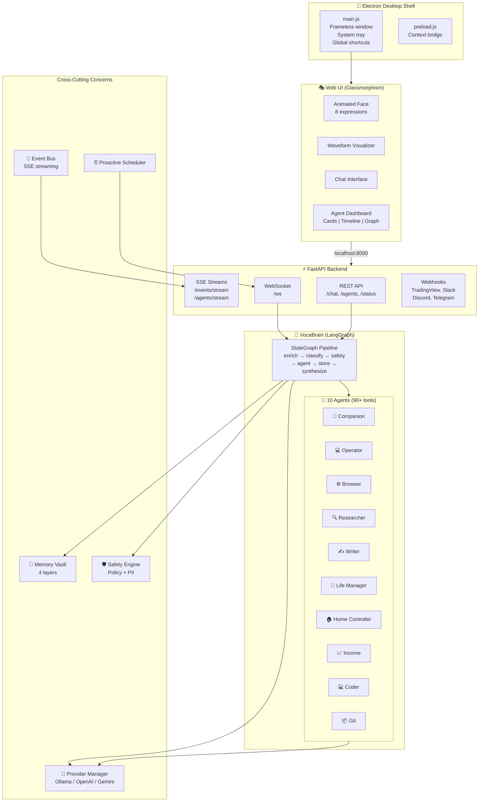
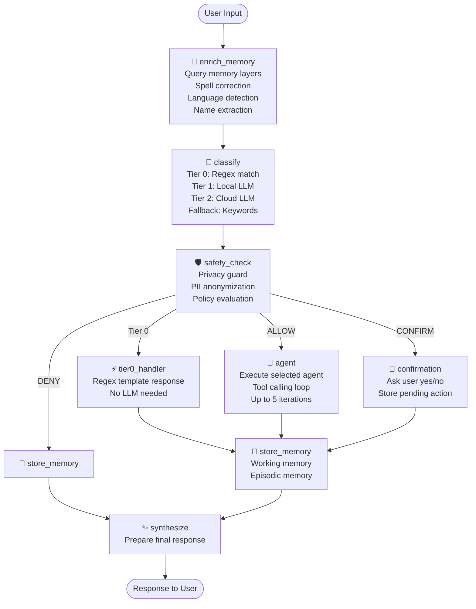
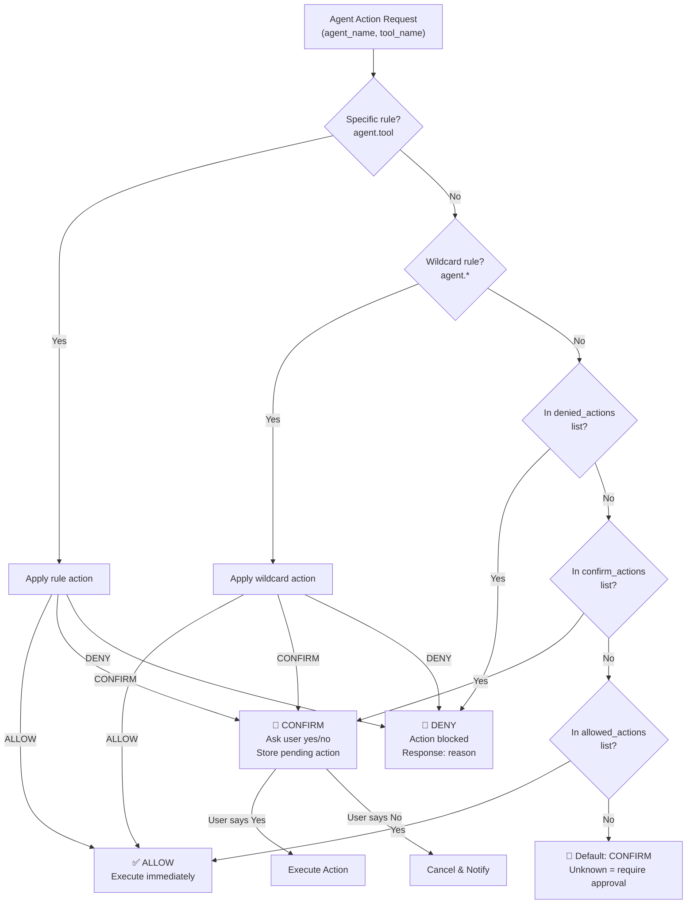
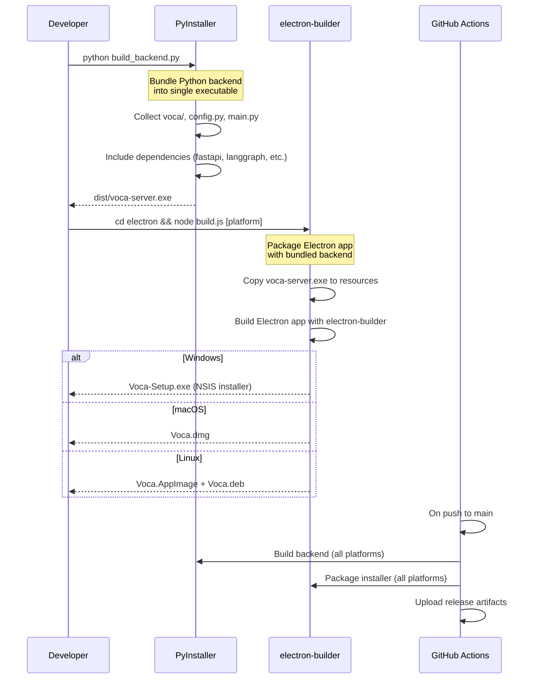
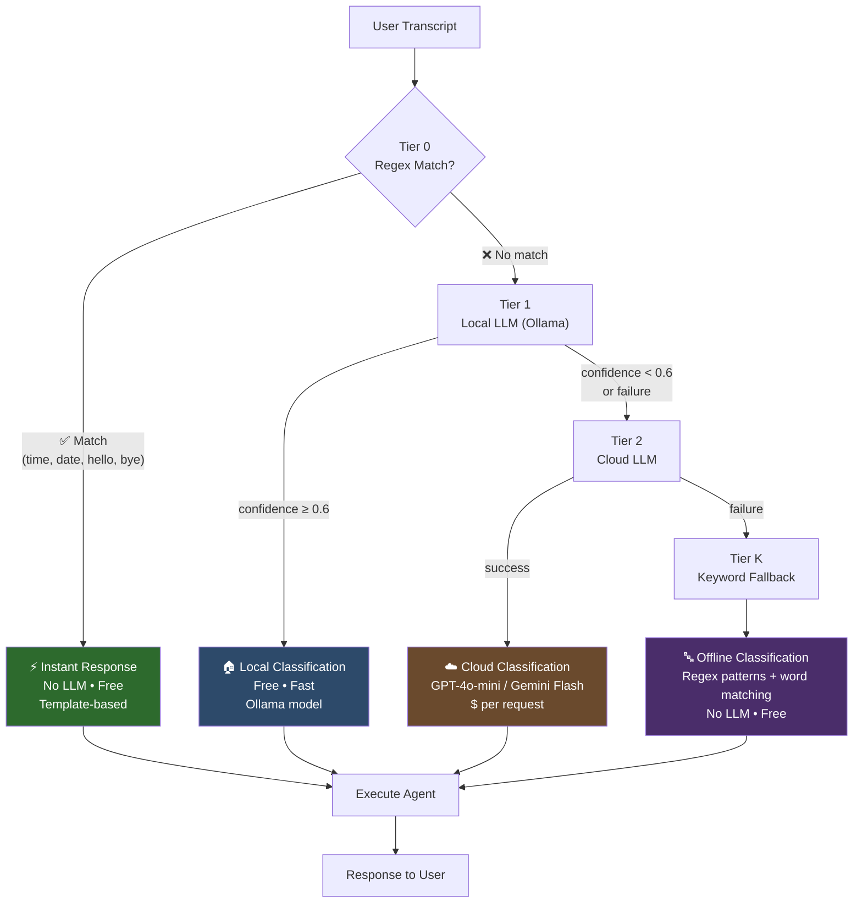

# eVoca Architecture Diagrams

All diagrams are written in [Mermaid](https://mermaid.js.org/) syntax and can be rendered in GitHub, VS Code (with Mermaid extension), or exported to PNG via `mmdc` (mermaid-cli).

---

## 1. System Architecture

High-level component diagram showing how the Electron shell, Web UI, FastAPI backend, LangGraph pipeline, and subsystems connect.



---

## 2. LangGraph Pipeline Flow

Flowchart showing the complete processing pipeline from user input to final response.



---

## 3. Agent Hierarchy

Class diagram showing the BaseAgent abstract class and all concrete agent implementations.

```mermaid
classDiagram
    class BaseAgent {
        <<abstract>>
        +name: str
        +description: str
        +tier: ModelTier
        +system_prompt: str
        +_tools: list~Tool~
        +run(state: VocaState) VocaState
        +respond_offline(state: VocaState) str
        #_setup_tools() void
        -_build_system_prompt(state) str
        -_extract_mood(text) str
    }

    class Tool {
        +name: str
        +description: str
        +parameters: dict
        +execute(**kwargs) dict
        +to_openai_schema() dict
    }

    class CompanionAgent {
        +tools: 4
        chat, joke, mood, activity
    }

    class OperatorAgent {
        +tools: 20
        apps, scripts, files, mouse
        keyboard, windows, processes
        system, services, network
        clipboard, notifications
    }

    class BrowserAgent {
        +tools: 11
        navigate, click, fill_form
        login, screenshot, extract
    }

    class ResearcherAgent {
        +tools: 4
        web_search, summarize
        papers, fact_check
    }

    class WriterAgent {
        +tools: 4
        draft, edit, format, translate
    }

    class LifeManagerAgent {
        +tools: 5
        calendar, reminders, todos
        email, events
    }

    class HomeControllerAgent {
        +tools: 6
        lights, thermostat, locks
        security, media, scenes
    }

    class IncomeAgent {
        +tools: 14
        prices, trading, portfolio
        Alpaca, IBKR, watchlist
    }

    class CoderAgent {
        +tools: 5
        read, write, edit files
        search code, VS Code
    }

    class GitAgent {
        +tools: 9
        status, diff, commit, push
        pull, branch, log, stash
        AI code review
    }

    BaseAgent <|-- CompanionAgent
    BaseAgent <|-- OperatorAgent
    BaseAgent <|-- BrowserAgent
    BaseAgent <|-- ResearcherAgent
    BaseAgent <|-- WriterAgent
    BaseAgent <|-- LifeManagerAgent
    BaseAgent <|-- HomeControllerAgent
    BaseAgent <|-- IncomeAgent
    BaseAgent <|-- CoderAgent
    BaseAgent <|-- GitAgent
    BaseAgent "1" --> "*" Tool : owns
```



---

## 4. Memory Architecture

Layer diagram showing the 4-layer memory system and data flow.

```mermaid
graph LR
    subgraph MemoryVault["🧠 Memory Vault (Facade)"]
        direction TB

        subgraph Working["Layer 1: Working Memory"]
            WM["Conversation Buffer<br/>Last 20 turns<br/>In-memory list"]
        end

        subgraph Episodic["Layer 2: Episodic Memory"]
            EM["FAISS Vector Index<br/>sentence-transformers embeddings<br/>Similarity search (top-k)"]
        end

        subgraph Semantic["Layer 3: Semantic Memory"]
            SM["Key-Value Store<br/>User facts (name, preferences)<br/>JSON persistence"]
        end

        subgraph Secure["Layer 4: Secure Vault"]
            SV["Fernet Encryption<br/>Browser credentials<br/>API keys & passwords"]
        end
    end

    Input["User Transcript"] -->|enrich()| Working
    Input -->|enrich()| Episodic
    Input -->|enrich()| Semantic

    Working -->|context| Pipeline["LangGraph Pipeline"]
    Episodic -->|relevant episodes| Pipeline
    Semantic -->|user facts| Pipeline

    Pipeline -->|store_interaction()| Working
    Pipeline -->|store_interaction()| Episodic
    Pipeline -->|remember_fact()| Semantic
```

---

## 5. Safety & Permission Flow

Decision tree showing how the safety engine evaluates actions.



---

## 6. Standalone App Build Pipeline

Sequence diagram showing how the desktop app is built and packaged.



---

## 7. Tier-Based LLM Routing

Flowchart showing how user input is classified and routed through the tier system.


